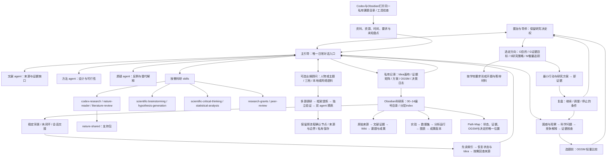

# 蛋挞博士研究工作台 · v1.7

从上向下阅读：先理解你的处境，再围绕问题思考；OGSM 在需要比较或落实行动时介入。箭头允许往返，人的选择始终可以修订。

Codex 与 Obsidian 打开同一个私有课题目录：前者协助思考与维护，后者浏览、链接与编辑。主引导按 Path-Map 找到唯一记录，不建立第二套状态或证据台账。

[打开原图查看细节](docs/assets/architecture.png)

## 可编辑图源

- agent 是分工角色，skills 是按需使用的方法；最多三个子 agent 同时运行，结果交回主引导核对。
- OGSM 是主引导内置参考，无需另装；未形成候选时继续思考，不要求填表。M 区分科学证据质量、执行进度与学校交付。
- 女娲六维是调研职责，不代表同时启动六个 agent。顾问提供资料支持的模拟视角，不代表真实专家意见。
- 公开 GitHub 仅保存系统和空白模板；真实资料、填写记录和生成顾问保存在私有工作副本。
- 安装成功不代表全文访问、PDF/OCR、多 agent 或真实专家蒸馏已经验证。

开始使用见 [启动指南](00_从这里开始.md)；安排研究见 [OGSM 指南](07_科研OGSM使用指南.md)；建立顾问见 [女娲指南](06_蒸馏专家做顾问.md)。

知识库布局与安装见 [科研知识库指南](09_科研知识库与Obsidian.md)。

每层使用 `00_index.md` 导航；记忆附来源、日期、适用范围与复核条件。新会话需要实际读取，不能把文件存在当作模型已经记住。目录的00–14编号见知识库指南。
