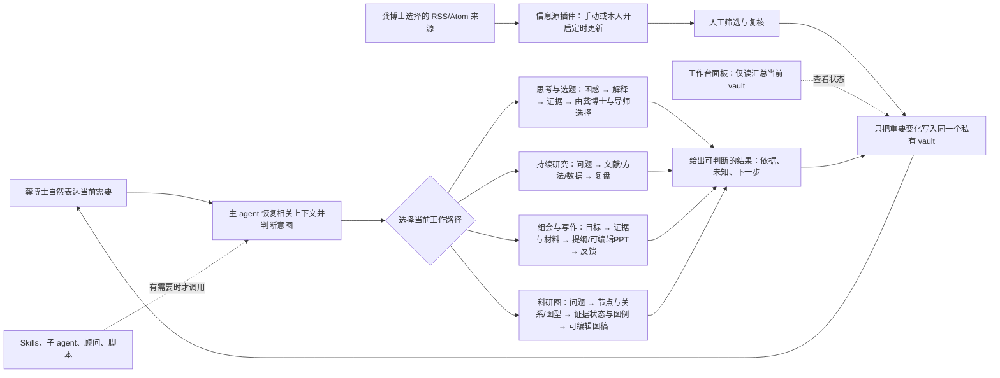

# 龚博士科研工作台 · 一个入口，持续协作

工作台围绕龚博士的实际问题运行，不要求她学习一套复杂操作。她只需在 Codex 里说今天要理解、查证、准备或完成什么。主 agent 负责恢复上下文、做当前必要的工作、呈现依据与未知，并把值得延续的信息放回同一个私有 Obsidian vault。

[打开高清图](docs/assets/architecture.png) · [SVG 矢量图](docs/assets/architecture.svg)

## 用户看到的简单循环

## 各部分做什么

| 部分 | 职责 | 使用方式 |
|---|---|---|
| 龚博士 | 提出困惑、校正画像、选择方向、与导师共同作研究决定 | 自然对话；不必记技能名称 |
| 主 agent | 唯一日常入口；了解授权资料、持续维护协作上下文、分辨任务、整合结论 | 每轮先理解要解决的事，再选最小工作路径 |
| 私有 Obsidian vault | 唯一权威研究档案：资料来源、文献证据、想法、方案、决策、组会、输出与长期记忆 | Codex 与 Obsidian 打开同一文件夹；Path-Map 指向各类记录的唯一位置 |
| RSS 信息源插件 | 收集龚博士主动添加的 RSS/Atom 线索，支持分组、搜索、未读/收藏和 OPML | 自动更新默认关闭；只有她主动保存的条目才写入收件箱，摘要待人工复核 |
| 工作台面板插件 | 展示 GY 当前 vault 中的记录数、待跟进项、RSS 待复核线索、最近更新与目录索引 | 只读当前库，不扫描库外文件、不联网、不代替原始索引 |
| 专项支持 | 文献检索、论文精读、统计、组会汇报、科研流程图/机制图/实验设计图、女娲顾问等具体方法 | 按任务调用；图稿证据审查由主引导协调，PPT Master 按需下载安装到当前工作区 |
| 子 agent | 处理可独立并行的检索或批判任务 | 可选；主 agent 核对、合并，多个意见不等于证据 |

## 唯一的研究档案

研究资料和长期记忆保存在龚博士自己的私有工作区。公开 GitHub 发行包只提供空白模板、说明和经许可可分发的工具。画像区分本人确认、来源材料、暂定观察与推断；AI 提议不写成龚博士的决定。原始资料尽量保留原样，敏感数据遵守机构受控环境要求。

同一事实只保留一个权威位置：当前进展在当前状态，思路变化在 Idea 画布/手记，文献细节在证据矩阵，人的取舍在决策日志，组会反馈在组会记录。其他地方用链接或 ID 指向它。收尾只更新有实际变化的记录，不为一次简单问答生成全套文档。

## 专项工具怎么进入

安装主引导后即可开始思考、资料梳理和知识库维护。外部科研 skills、插件、MCP、脚本、数据包和计算环境都属于可选能力：主 agent 先判断它们能否解决当前问题，再核查兼容性、许可、隐私和依赖。用户没有具体研究方向前，不默认安装庞大技能包。见 [GitHub 扩展候选与试用标准](11_GitHub扩展候选与试用标准.md)。

## 决策与质量边界

- 选题、假说、实验执行及其他研究决定由龚博士与导师掌握；主 agent 提供依据、备选解释、风险和可行下一步。
- 原文、数据库结果、本人陈述、推断和待核实内容分开标记；来源失败不等于没有证据。
- Skills 和子 agent 是工作方法，不是独立的科学权威。按其真实可执行范围介绍，不把格式校验说成科学验证。
- 科研图中每个关键节点和关系都要能追溯来源、模型和证据状态；推断、待验证假说和计划用图例区分，图形美观不能替代龚博士的科学判断。
- 多 agent、工作流和自动化都不是默认前置；优先减少配置、重复输入和无必要产物。

## 可编辑图源

矢量架构图保存在 `docs/assets/architecture.svg`，PNG 是发行预览版；上方 Mermaid 表示用户实际经历的核心循环。修改系统逻辑后应同步更新图、vault 首页和启动指南。

开始使用：[启动页](00_从这里开始.md) · Obsidian：[知识库指南](09_科研知识库与Obsidian.md) · 组会：[持续研究指南](10_组会与持续研究指南.md) · 可编辑PPT与科研图：[汇报和制图指南](13_科研汇报与可编辑PPT指南.md) · 扩展：[候选与试用标准](11_GitHub扩展候选与试用标准.md)
