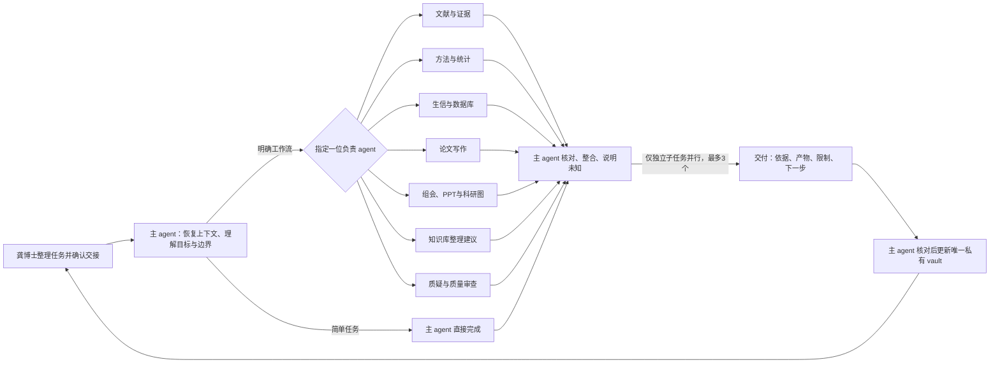

# 龚博士科研工作台：一个入口，职责 agent 按需负责

龚博士从桌面图标打开工作台，选择任务并补充本次目标；工作台可在选定的 Codex 工作区创建新对话、打开并复制启动语。她粘贴、确认后，Codex 主 agent 恢复授权上下文、按需组织职责 agent 与技能，核对交付，再把确认过的长期状态接续到 Obsidian。

[打开高清图](docs/assets/architecture.png) · [SVG 矢量图](docs/assets/architecture.svg)

## 桌面工作台入口与使用说明

[图片版使用说明](docs/assets/quickstart.png) · [工作台流程矢量图](docs/assets/workbench-map.svg)

开始页提供选题、论文、PPT、组会准备 / 复盘和生物科研日报入口；研究记录、机制图、文献与知识库同属主导航。Windows x64 安装版提供桌面和开始菜单图标，并在独立窗口打开；本机桥接服务随应用启动，仅绑定 `127.0.0.1:48921`。选中 Obsidian 文件夹后，可显式检查科研目录名称，并在本人确认后补齐缺失的空文件夹；疑似旧目录名会提示但不自动搬动内容。工作台可逐项授权读取研究记录、文献笔记、RSS 已有缓存或查看归档；新建归档需要单独授权，且只创建新文件。草稿保存在本机应用存储中，关闭后可恢复；桥接服务保存当前目录和范围于进程内存，应用退出后需重新授权。工作台可读取本机 Codex 项目列表，在选定工作区创建并打开新对话，将启动语复制到系统剪贴板；Codex 当前不支持预填输入框，需由使用者粘贴、检查并提交。工作台不读取 Codex 历史对话。

## 实际协作循环

```mermaid
flowchart LR
    U[龚博士整理任务并确认交接] --> M[主 agent：恢复上下文、理解目标与边界]
    M -->|简单任务| D[主 agent 直接完成]
    M -->|明确工作流| A{指定一位负责 agent}
    A --> E[文献与证据]
    A --> S[方法与统计]
    A --> B[生信与数据库]
    A --> W[论文写作]
    A --> C[组会、PPT与科研图]
    A --> K[知识库整理建议]
    A --> Q[质疑与质量审查]
    E --> R[主 agent 核对、整合、说明未知]
    S --> R
    B --> R
    W --> R
    C --> R
    K --> R
    Q --> R
    D --> R
    R -->|仅独立子任务并行，最多3个| P[交付：依据、产物、限制、下一步]
    P --> H[主 agent 核对后更新唯一私有 vault]
    H --> U
```

## 职责边界

| 角色 | 负责的工作 | 主要交付 |
|---|---|---|
| 主 agent | 唯一入口；恢复授权上下文、了解偏好、分派与汇总 | 清楚的依据、未知、下一步；核对后的共享状态 |
| `danta_evidence` | 检索、精读、证据核查、研究空白、日报线索复核 | 有来源和阅读范围的证据与争议 |
| `danta_methods` | 研究设计、终点、统计假设、可行性 | 设计选项、假设、区分解释的检查点 |
| `danta_bioinformatics` | 数据库映射、生信方案、获授权的分析执行 | 可追溯的查询/分析结果与运行记录 |
| `danta_writing` | 论文起草、修订、翻译、审稿回复、投稿材料 | 指定路径中的稿件草案与作者待核实项 |
| `danta_communication` | 组会准备/复盘、汇报 PPT、科研图 | 指定路径中的可编辑汇报产物和质检结果 |
| `danta_knowledge` | 权威路径、索引、归档与长期记忆整理 | 只读的归档建议草稿，由主 agent 审阅后写入 |
| `danta_critic` | 对选题论证、设计、稿件和汇报做独立质疑 | 有位置、影响和处理建议的缺口清单 |

技能（Skills）提供查文献、统计、写作、制图等工作方法；agent 负责一个可识别的工作职责。文献检索由 Consensus/Semantic Scholar 等来源召回候选；Jev 接入后在公开结果达到条件时自动做相关性排序，对可疑页面做辅助筛查，并在有公开原文的关键主张核对环节辅助验证，龚博士无需知道或点名工具。Jev 不替代检索、原文阅读与证据评价，也不接收默认私有的 vault 内容。需要时使用最少的技能，不把每个技能再建成一个 agent。选题思考由主 agent 陪龚博士展开，研究方向、假说、实验和最终稿的决定归龚博士与导师。

## 分工与并发规则

- 一项主要交付指定一位负责人。简单澄清、小编辑和已有信息就能解决的任务由主 agent 直接完成。
- 两个问题彼此独立时才并行；有依赖时按“证据 → 方法选择 → 写作/汇报 → 质疑复核”的顺序推进。项目并发上限为 3，不要求全员参加。
- 每张任务单说明目标、当前状态版本、本人约束、允许读取的资料、输出路径、交付格式和停止条件；不把整段聊天或无关私人资料传给 agent。
- 生信、写作和汇报角色只在本轮指定的位置创建交付物，不覆盖原始数据或旧稿。知识库 agent 默认只读。主 agent 是共享画像、当前状态和决策日志的唯一写入协调者。
- 只有真实派工并收到结果后才能记录为 agent 协作；角色配置存在不代表客户端已加载。调用失败时由主 agent 明确说明，并继续可完成的部分。

## 唯一的研究档案

研究事实、证据、想法、本人决定、组会反馈、产物和长期记忆保存在龚博士的唯一私有 Obsidian vault。Path-Map 指向唯一权威记录；agent 结果先核对来源、状态和是否过时，再由主 agent 合并。多人意见一致不构成新增证据，临时讨论或模型推断也不自动成为长期记忆。

RSS 插件把龚博士选择的信息源缓存到当前 vault；工作台只在本人授权后读取插件现有缓存与指定笔记，不刷新订阅或抓取全文。桌面工作台桥接层的授权范围不改变 Codex 的文件系统权限；Codex 是否读取 vault 仍按本机运行权限和本轮明确任务范围判断。公开检索服务只接收公开检索内容，不自动接收私有笔记。

## 入口文档

[启动页](00_从这里开始.md) · [多 agent 使用指南](05_多Agent使用指南.md) · [科研知识库与 Obsidian](09_科研知识库与Obsidian.md) · [组会与持续研究](10_组会与持续研究指南.md) · [科研汇报与可编辑 PPT](13_科研汇报与可编辑PPT指南.md)
