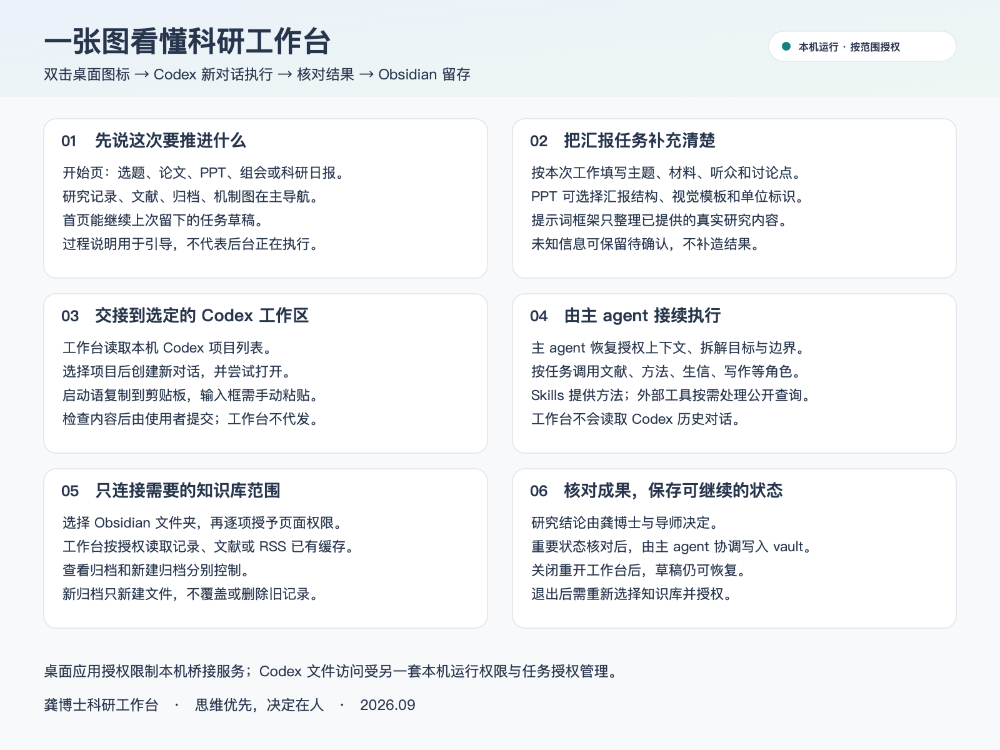
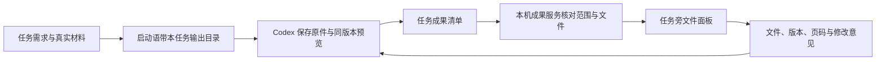
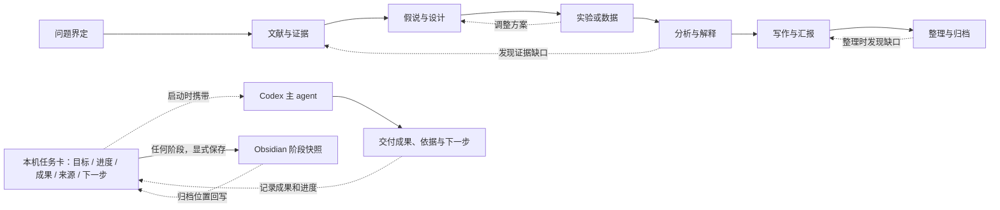
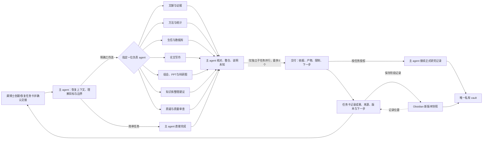

# 龚博士科研工作台：一个入口，职责 agent 按需负责

## 2026-10-05 体系补充（未发布）

[面向龚博士的完整介绍](docs/architecture/2026-10-05-龚博士科研工作台体系与使用介绍.md) 与 [新版体系图](apps/danta-workbench-ui/public/framework-overview.svg) 按当前源码核对。顶部使用说明改为离线说明窗口；原图保留作历史维护材料。

- 当前实际步骤增加可选生信材料线索，随任务、本机恢复与快照保留，并进入 Codex 启动语。界面只记录，不读取输入；实际执行环境在 Codex 按需要核对。
- 成果清单可选 provenance，引用任务目录内本版本来源 JSON。服务检查任务/成果/版本匹配与格式，限定读取范围；来源、脚本、输入和日志索引仅显示。
- 成果面板按需展示运行报告与核查报告；原件 SHA-256 核对由本人点击后进行（最大 100 MB）。不自动执行分析，不将计算成功、报告核查和科学结论混为同一状态；旧清单仍可使用。
- 交付规则保存在主引导 references/bioinformatics-delivery.md，Methods 从真实运行记录整理。尚未自动接入 GEO 下载、MultiQC 交互报告或完整生信计算环境。

下面保留前期架构与实施说明；带日期的历史验收状态不代表本轮 Windows 实机已验证。

龚博士从桌面图标打开工作台，创建或恢复研究任务卡，记录当前阶段、状态、下一步和待确认问题；工作台可重新打开该任务关联的 Codex 对话，也可在选定工作区创建带任务快照的新对话。她粘贴、提交后，Codex 主 agent 按需组织职责 agent 与技能，核对交付。研究任务卡与成果索引保存在本机应用中，任何阶段都可将任务快照保存到 Obsidian。阶段快照保留来源、版本和未决问题，不代表科学结论已验证；正式研究状态仍由主 agent 按授权接续。

[打开高清图](docs/assets/architecture.png) · [SVG 矢量图](docs/assets/architecture.svg)

## 桌面工作台入口与使用说明

[图片版使用说明](docs/assets/quickstart.png) · [工作台流程矢量图](docs/assets/workbench-map.svg)

主导航分为今天、研究任务、文献资料、汇报制图和设置；首页优先接续上次任务，具体工作从对应区域进入；从入口创建的每项工作拥有独立的本机任务卡，可重复创建同一类型的多项任务。卡片记录任务名、研究阶段、状态、目标、下一步、待确认问题、工作台记录的文件名和 Codex 对话编号。研究阶段与状态由龚博士维护，工作台不读取 Codex 历史来自动推断进展。任务卡的创建、恢复、旧草稿迁移和本地更新由 `apps/danta-workbench-ui/src/features/research-tasks/hooks/useResearchTasks.js` 负责；`App.jsx` 负责页面导航和把当前任务交给工作区，不直接维护任务数据规则。研究记录、文献、日报和归档归入文献资料；PPT、组会和机制图归入汇报制图；知识库授权与任务备份归入设置。Windows x64 安装版提供桌面和开始菜单图标，并在独立窗口打开；本机桥接服务随应用启动，仅绑定 `127.0.0.1:48921`。选中 Obsidian 文件夹后，可显式检查科研目录名称，并在本人确认后补齐缺失的空文件夹；疑似旧目录名会提示但不自动搬动内容。工作台可逐项授权读取研究记录、文献笔记、RSS 已有缓存或查看归档；新建归档需要单独授权，且只创建新文件。正式桌面版在本机应用数据中自动保存任务卡、页面、草稿和交接状态，启动时先恢复状态，关闭前等待落盘；保留最近版本和最多 10 份历史备份，在设置中恢复，恢复前保留当前版本。浏览器存储作为兼容缓存，开发预览仍使用浏览器存储；桌面桥接服务在本机应用数据中保存本人确认的知识库路径、目录关联和授权范围，重启时核对路径与目录后恢复；目录变化时仅暂停受影响的范围。工作台可读取本机 Codex 项目列表，在选定工作区创建并打开新对话，将启动语复制到系统剪贴板；Codex 当前不支持预填输入框，需由使用者粘贴、检查并提交。工作台不读取 Codex 历史对话。

## 任务内成果预览（2026-10-01 本机开发稿）

在原有任务工作区旁增加文件面板，保留五个主导航。设置中的“成果与预览”绑定实际成果根目录；授权与目录身份独立存本机应用数据，不继承 Obsidian 的 Markdown 范围，也不上传原件。`server/artifactService.js` 负责目录恢复、任务清单校验、原生文件关联、只读内容和原件打开；`src/features/artifacts/` 负责标签、格式查看器、意见与交接文本。桥接仅接受本机同源请求，以任务 ID 与验证后的成果 ID 定位文件，不接受客户端任意读取路径。

```mermaid
flowchart LR
  T[任务需求与真实材料] --> P[启动语带本任务输出目录]
  P --> C[Codex 保存原件与同版本预览]
  C --> J[任务成果清单]
  J --> S[本机成果服务核对范围与文件]
  S --> V[任务旁文件面板]
  V --> F[文件、版本、页码与修改意见]
  F --> C
```

PDF 采用本地 PDF.js；图片、Markdown/TXT 和隔离 HTML 分格式查看。PPTX/DOCX 优先配套 PDF；第一版不转换 Office 原件，不支持分页图片集合。预览标签、PDF 页码、缩放、外层阅读位置和意见随任务卡保存，HTML 内部滚动暂不恢复。目录与手动文件关联单独保存，任务备份不复制原件或迁移读取授权。修改仍通过既有 Codex 弹窗复制并进入原对话，由使用者粘贴提交。当前源码与桌面构建已接入，Windows 实机全流程及正式安装包仍待验收发布。

## 研究任务生命周期与状态

研究任务按“问题界定 → 文献与证据 → 假说与设计 → 实验或数据 → 分析与解释 → 写作与汇报 → 整理与归档”组织。流程允许返回前序阶段；当前阶段和任务状态由龚博士在任务卡中更新，不代表系统已验证阶段产物。

```mermaid
flowchart LR
    Q[问题界定] --> E[文献与证据] --> D[假说与设计] --> X[实验或数据] --> A[分析与解释] --> C[写作与汇报] --> R[整理与归档]
    A -.发现证据缺口.-> E
    X -.调整方案.-> D
    R -.整理时发现缺口.-> C
    T[本机任务卡：目标 / 进度 / 成果 / 来源 / 下一步] -.启动时携带.-> M[Codex 主 agent]
    M --> U2[交付成果、依据与下一步]
    U2 -.记录成果和进度.-> T
    T -->|任何阶段，显式保存| V[Obsidian 阶段快照]
    V -.归档位置回写.-> T
```

任务卡用于恢复工作、记录成果索引与组织交接。“成果与来源”区保存产物名称、类型、文件位置或链接、版本、来源定位和未决问题；这些索引随启动语交接。连接知识库并开启归档写入后，点击“保存阶段记录到 Obsidian”会新建一份 Markdown，保存当时的任务内容、进度、来源索引、版本和下一步，并将归档相对路径回写到对应任务卡。同名多次保存保留多个版本；保存不改变任务状态，也不要求先完成或审核。手工“成果与来源”索引只记录位置；实际成果预览由下面的独立成果服务负责，不因手工填写路径而扩大文件读取范围。正式证据、研究者决定和组会反馈仍保留各自的来源与证据状态。

旧草稿复制迁移为任务卡，迁移不删除旧草稿。PPT 进入机制图时建立关联子任务，带入前序内容、文件名与成果索引；返回可继续原 PPT 任务。

## 实际协作循环

```mermaid
flowchart LR
    U[龚博士创建/恢复任务卡并确认交接] --> M[主 agent：恢复上下文、理解目标与边界]
    M -->|简单任务| D[主 agent 直接完成]
    M -->|明确工作流| A{指定一位负责 agent}
    A --> E[文献与证据]
    A --> S[方法与统计]
    A --> B[生信与数据库]
    A --> W[论文写作]
    A --> C[组会、PPT与科研图]
    A --> K[知识库整理建议]
    A --> Q[质疑与质量审查]
    E --> R[主 agent 核对、整合、说明未知]
    S --> R
    B --> R
    W --> R
    C --> R
    K --> R
    Q --> R
    D --> R
    R -->|仅独立子任务并行，最多3个| P[交付：依据、产物、限制、下一步]
    P --> T[任务卡记录成果、来源、版本与下一步]
    T -->|保存阶段记录| H[Obsidian 新版本快照]
    P -->|按任务授权| K2[主 agent 接续正式研究记录]
    K2 --> V[唯一私有 vault]
    H --> V
    H -.记录位置.-> T
    T --> U
```

## 职责边界

agent 的名称、调用范围、读写方式和交付格式以 `.codex/agents/*.toml` 为准；科研能力的实际使用规则以 `skills/*/SKILL.md` 为准。主引导按任务调用相应角色及技能；前端只准备任务上下文，不在浏览器中执行 agent 或 skill。完整路由见 [科研工作流与能力路由](docs/architecture/科研工作流与能力路由.md)。

| 角色 | 负责的工作 | 主要交付 |
|---|---|---|
| 主 agent | 唯一入口；恢复授权上下文、了解偏好、分派与汇总 | 清楚的依据、未知、下一步；核对后的共享状态 |
| `danta_evidence` | 检索、精读、证据核查、研究空白、日报线索复核 | 有来源和阅读范围的证据与争议 |
| `danta_methods` | 研究设计、终点、统计假设、可行性 | 设计选项、假设、区分解释的检查点 |
| `danta_bioinformatics` | 数据库映射、生信方案、获授权的分析执行 | 可追溯的查询/分析结果与运行记录 |
| `danta_writing` | 论文起草、修订、翻译、审稿回复、投稿材料 | 指定路径中的稿件草案与作者待核实项 |
| `danta_communication` | 组会准备/复盘、汇报 PPT、科研图 | 指定路径中的可编辑汇报产物和质检结果 |
| `danta_knowledge` | 权威路径、索引、归档与长期记忆整理 | 只读的归档建议草稿，由主 agent 审阅后写入 |
| `danta_critic` | 对选题论证、设计、稿件和汇报做独立质疑 | 有位置、影响和处理建议的缺口清单 |

技能（Skills）提供查文献、统计、写作、制图等工作方法；agent 负责一个可识别的工作职责。文献检索由 Consensus/Semantic Scholar 等来源召回候选；Jev 接入后在公开结果达到条件时自动做相关性排序，对可疑页面做辅助筛查，并在有公开原文的关键主张核对环节辅助验证，龚博士无需知道或点名工具。Jev 不替代检索、原文阅读与证据评价，也不接收默认私有的 vault 内容。需要时使用最少的技能，不把每个技能再建成一个 agent。选题思考由主 agent 陪龚博士展开，研究方向、假说、实验和最终稿的决定归龚博士与导师。

## 分工与并发规则

- 一项主要交付指定一位负责人。简单澄清、小编辑和已有信息就能解决的任务由主 agent 直接完成。
- 两个问题彼此独立时才并行；有依赖时按“证据 → 方法选择 → 写作/汇报 → 质疑复核”的顺序推进。项目并发上限为 3，不要求全员参加。
- 每张任务单说明目标、当前状态版本、本人约束、允许读取的资料、输出路径、交付格式和停止条件；不把整段聊天或无关私人资料传给 agent。
- 生信、写作和汇报角色只在本轮指定的位置创建交付物，不覆盖原始数据或旧稿。知识库 agent 默认只读。主 agent 是共享画像、当前状态和决策日志的唯一写入协调者。
- 只有真实派工并收到结果后才能记录为 agent 协作；角色配置存在不代表客户端已加载。调用失败时由主 agent 明确说明，并继续可完成的部分。

## 唯一的研究档案

研究事实、证据、想法、本人决定、组会反馈、产物和长期记忆保存在龚博士的唯一私有 Obsidian vault。Path-Map 指向唯一权威记录；agent 结果先核对来源、状态和是否过时，再由主 agent 合并。多人意见一致不构成新增证据，临时讨论或模型推断也不自动成为长期记忆。

RSS 插件把龚博士选择的信息源缓存到当前 vault；工作台只在本人授权后读取插件现有缓存与指定笔记，不刷新订阅或抓取全文。桌面工作台桥接层的授权范围不改变 Codex 的文件系统权限；Codex 是否读取 vault 仍按本机运行权限和本轮明确任务范围判断。公开检索服务只接收公开检索内容，不自动接收私有笔记。

## 入口文档

[启动页](00_从这里开始.md) · [多 agent 使用指南](05_多Agent使用指南.md) · [科研知识库与 Obsidian](09_科研知识库与Obsidian.md) · [组会与持续研究](10_组会与持续研究指南.md) · [科研汇报与可编辑 PPT](13_科研汇报与可编辑PPT指南.md)
