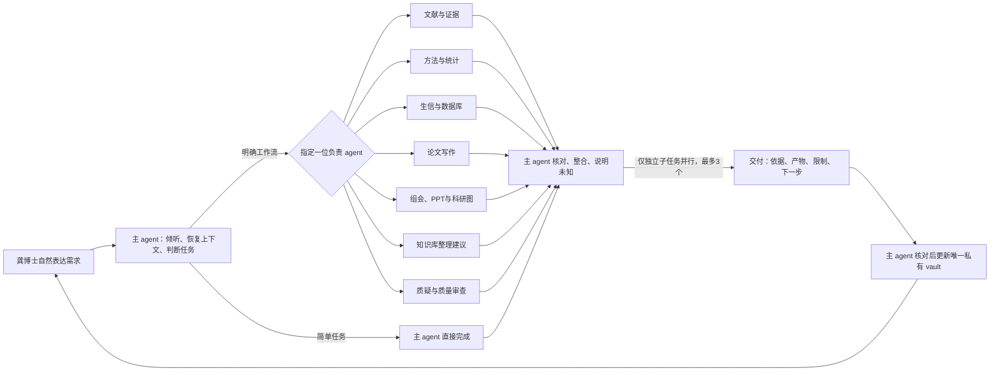

# 龚博士科研工作台：一个入口，职责 agent 按需负责

龚博士只需用自然语言说想推进什么。主 agent 恢复相关上下文，选择相应职责 agent 或亲自完成简单任务，再核对交付并接续工作。agent 按工作流负责，不需要龚博士记名字、挑技能或反复写长提示词。

[打开高清图](docs/assets/architecture.png) · [SVG 矢量图](docs/assets/architecture.svg)

## 网页入口与使用说明

[图片版使用说明](docs/assets/quickstart.png) · [网页框架矢量图](docs/assets/workbench-map.svg)

开始页提供选题思路、论文写作、PPT、组会准备 / 复盘和生物科研日报五个独立工作区；研究记录、机制图、文献与知识库同属主导航。PPT 工作区也可打开机制图工作区，BioTender 与 BioRender 入口放在机制图页内。过程按钮展示方法步骤，不代表实时执行。顶部更新入口比较本机提交与 GitHub `main`，并复制由 Codex 在本机执行的更新指令。网页对话同步、研究资料读取、RSS 数据和 GY 同步尚未接入；文件区只暂存名称并在刷新后清空。

## 实际协作循环

```mermaid
flowchart LR
    U[龚博士自然表达需求] --> M[主 agent：倾听、恢复上下文、判断任务]
    M -->|简单任务| D[主 agent 直接完成]
    M -->|明确工作流| A{指定一位负责 agent}
    A --> E[文献与证据]
    A --> S[方法与统计]
    A --> B[生信与数据库]
    A --> W[论文写作]
    A --> C[组会、PPT与科研图]
    A --> K[知识库整理建议]
    A --> Q[质疑与质量审查]
    E --> R[主 agent 核对、整合、说明未知]
    S --> R
    B --> R
    W --> R
    C --> R
    K --> R
    Q --> R
    D --> R
    R -->|仅独立子任务并行，最多3个| P[交付：依据、产物、限制、下一步]
    P --> H[主 agent 核对后更新唯一私有 vault]
    H --> U
```

## 职责边界

| 角色 | 负责的工作 | 主要交付 |
|---|---|---|
| 主 agent | 唯一入口；恢复授权上下文、了解偏好、分派与汇总 | 清楚的依据、未知、下一步；核对后的共享状态 |
| `danta_evidence` | 检索、精读、证据核查、研究空白、日报线索复核 | 有来源和阅读范围的证据与争议 |
| `danta_methods` | 研究设计、终点、统计假设、可行性 | 设计选项、假设、区分解释的检查点 |
| `danta_bioinformatics` | 数据库映射、生信方案、获授权的分析执行 | 可追溯的查询/分析结果与运行记录 |
| `danta_writing` | 论文起草、修订、翻译、审稿回复、投稿材料 | 指定路径中的稿件草案与作者待核实项 |
| `danta_communication` | 组会准备/复盘、汇报 PPT、科研图 | 指定路径中的可编辑汇报产物和质检结果 |
| `danta_knowledge` | 权威路径、索引、归档与长期记忆整理 | 只读的归档建议草稿，由主 agent 审阅后写入 |
| `danta_critic` | 对选题论证、设计、稿件和汇报做独立质疑 | 有位置、影响和处理建议的缺口清单 |

技能（Skills）提供查文献、统计、写作、制图等工作方法；agent 负责一个可识别的工作职责。需要时使用最少的技能，不把每个技能再建成一个 agent。选题思考由主 agent 陪龚博士展开，研究方向、假说、实验和最终稿的决定归龚博士与导师。

## 分工与并发规则

- 一项主要交付指定一位负责人。简单澄清、小编辑和已有信息就能解决的任务由主 agent 直接完成。
- 两个问题彼此独立时才并行；有依赖时按“证据 → 方法选择 → 写作/汇报 → 质疑复核”的顺序推进。项目并发上限为 3，不要求全员参加。
- 每张任务单说明目标、当前状态版本、本人约束、允许读取的资料、输出路径、交付格式和停止条件；不把整段聊天或无关私人资料传给 agent。
- 生信、写作和汇报角色只在本轮指定的位置创建交付物，不覆盖原始数据或旧稿。知识库 agent 默认只读。主 agent 是共享画像、当前状态和决策日志的唯一写入协调者。
- 只有真实派工并收到结果后才能记录为 agent 协作；角色配置存在不代表客户端已加载。调用失败时由主 agent 明确说明，并继续可完成的部分。

## 唯一的研究档案

研究事实、证据、想法、本人决定、组会反馈、产物和长期记忆保存在龚博士的唯一私有 Obsidian vault。Path-Map 指向唯一权威记录；agent 结果先核对来源、状态和是否过时，再由主 agent 合并。多人意见一致不构成新增证据，临时讨论或模型推断也不自动成为长期记忆。

RSS 插件收集龚博士选择的信息源；工作台面板只读汇总当前 vault。两者不会自动授予 agent 扫描库外资料的权限。首次批量读取资料前仍需本人明确授权范围；第三方平台处理材料前需说明材料与用途并得到本人同意。

## 入口文档

[启动页](00_从这里开始.md) · [多 agent 使用指南](05_多Agent使用指南.md) · [科研知识库与 Obsidian](09_科研知识库与Obsidian.md) · [组会与持续研究](10_组会与持续研究指南.md) · [科研汇报与可编辑 PPT](13_科研汇报与可编辑PPT指南.md)
