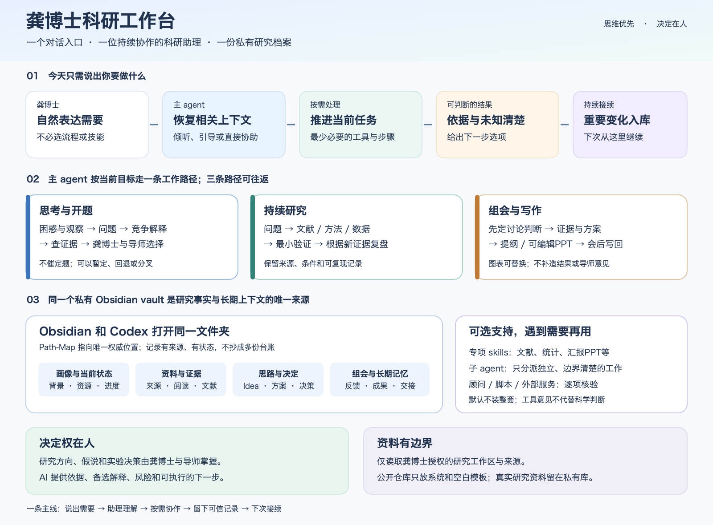

# 龚博士科研工作台

**思维优先，决策在人。** 主 agent 是龚博士博士期间的持续科研助理与思考搭档：在她授权的工作区逐步了解资料和协作偏好，延续研究脉络，再通过倾听、证据和不同解释帮助她推进当下问题。

本仓库是可下载的科研辅助工作区：包含龚博士的主引导 skill、固定版本科研 skills、可编辑PPT skill、女娲专家蒸馏 skill、可选专家角色配置和空白模板。它需要支持文件与工具的 AI 客户端运行，不是独立网页应用。扩展包不要求新使用者安装。

## 最快开始：下载一个知识库，打开两个应用

龚博士已经使用 Obsidian，建议下载 [独立知识库 ZIP](https://github.com/youir/danta-research-workbench/releases/latest/download/danta-research-vault-v1.11.0.zip)，解压到私有研究目录；Obsidian 和 Codex 同时打开 ZIP 中的 `00_科研知识库_Research-Vault`。主引导、PPT支持技能和个人画像模板已附带，无须先安装整套技能或运行命令。只在第一次要求制作PPTX时配置生成依赖。想让 Codex 帮忙部署，照着 [本机部署与首次配置](12_本机部署与首次配置.md) 复制启动语即可。

这是默认且唯一推荐的新项目入口。需要维护发行文件、离线安装第三方 skills 或运行校验时，维护者再使用完整工作台包。已有项目应继续使用其唯一私有工作区，不要为了采用新版本复制出第二套当前记录。

## 完整工作台（维护者/按需扩展）

1. 从 release 下载完整 ZIP 或克隆仓库，保留隐藏目录 `.codex/`。
2. 首次先运行 `python3 scripts/start_project.py`，在不受 Git 跟踪的 `.local/research-workbench/` 创建自己的工作副本；也可用 `--dest` 指定仓库外的新目录。
3. 在 Codex 打开新副本，阅读 [00_从这里开始.md](00_从这里开始.md)，复制其中的启动语。
4. 只有任务确实需要时，再看 [安装指南](01_安装与环境指南.md)、[多 agent 指南](05_多Agent使用指南.md) 或 [GitHub 扩展候选](11_GitHub扩展候选与试用标准.md)。默认单 agent 已能工作。

选择完整工作台时，Python 用于创建隔离研究副本和运行维护脚本；日常思考不要求先安装科学计算库。知识库独立 ZIP 可直接打开，不需要 Python。

## 一个对话入口，专家按需加入

| 角色 | 职责 | 不代替什么 |
|---|---|---|
| 主引导 | 理解困惑、拆任务、核对结果、与你讨论、维护记录 | 研究者与导师的决定 |
| 文献 agent | 有并行价值时核查原始研究、相近工作和相反证据 | 真实全文阅读与来源核验 |
| 方法 agent | 需要独立复核时检查比较、对照、终点、研究单位和可行性 | 真实实验结果或资源确认 |
| 质疑 agent | 对重要主张做边界明确的反证 | 以投票确定科学真伪 |

单 agent 是默认工作方式。只有任务确实可拆成相互独立的部分时才委派，专家默认只读、主引导统一写研究记录；多人一致不构成新增证据。



[查看原图](docs/assets/architecture.png) · [架构说明与可编辑图源](08_完整体系架构.md)

项目角色配置依据 [OpenAI 官方子 agent 文档](https://learn.chatgpt.com/docs/agent-configuration/subagents)，核对日期 2026-09-24。配置存在不代表客户端已经加载，也不等于真实多 agent 已执行；首次按指南做最小调用验证。

## 这次优化

保留更新版的 Idea 画布、关键追问和主张—证据映射，同时调整：

- 三个冻结点变为可回看的检查节点；暂定思路可以继续推演。
- 区分人的方案选择、科学证据与具体动作受阻。
- 已有证据与计划取得的证据分开，不预设根本成因。
- 检索与逐篇证据以 CSV 为正式记录，台账负责索引与综合判断。
- 多 agent 返回证据与分歧，由主引导核对，不各自问用户或改共享文件。

## 目录

- [主引导技能](skills/danta-proposal-guide/SKILL.md) 与 [协作协议](skills/danta-proposal-guide/references/multi-agent.md)
- `.codex/agents/`：三个项目级角色配置
- `vendor/skills/`：九个固定提交版本的第三方科研技能、女娲专家蒸馏 skill 及 nature-shared 支持包
- `我的开题/`：空白模板，运行时请使用本地副本
- [全周期课题助手](variants/mentor-agent/index.md)：可选的另一种工作区，包含开题后的研究推进；二选一作为主工作区
- [GitHub 扩展候选与试用标准](11_GitHub扩展候选与试用标准.md)：近期项目、许可核查和按需试用流程
- [本机部署与首次配置](12_本机部署与首次配置.md)：复制给 Codex 的部署说明
- [科研汇报与可编辑PPT指南](13_科研汇报与可编辑PPT指南.md)：提纲、编辑对象、组会与开题PPT流程
- [验证与优化说明](04_打包验证说明.md)

本仓库不含真实研究数据、私人聊天、账号配置或已启用的后台日报。日报线索只能作为待核实信息；复制工作区不会迁移已有自动化。

## v1.10 易用性与架构收敛

新手默认下载独立 Obsidian vault ZIP，不需安装第三方 skills；主 agent 根据自然语言请求选用思考与开题、持续研究或组会写作路径。Codex 和 Obsidian 共用唯一私有 vault，技能、专家和外部服务仅按需开启。初始资料扫描需龚博士本人先授权指定范围，摘要带来源并待她核对。框架图已换成可编辑 SVG 与同步 PNG；候选扩展页记录许可和评估状态。

## v1.11 科研汇报与可编辑 PPT

新增组会/开题/阶段汇报工作流和可编辑PPT指南。先从授权材料提取证据状态、讨论目标与故事线，再用 MIT 许可的 GitHub `presentation-skill` 保留 `outline.json`、生成 PPTX 并质检。Obsidian增设汇报输出索引和模板，框架图同步标出PPT出口。首次生成时才按上游说明配置 Node/Python依赖；默认不联网搜图或调用图像生成 API，视频中的私有平台不属于本工作台。

## 验证

```bash
python3 scripts/validate_release.py
```

测试包括完整性、安装/重复安装/冲突保护、隔离工作副本与本地链接。它不证明学术判断正确，也不替代使用者设备上的子 agent 运行验证。

第三方来源、许可证与扩展依赖见 [Skills来源与边界](03_Skills来源与边界.md) 和 [THIRD_PARTY_NOTICES.md](THIRD_PARTY_NOTICES.md)。

## v1.3 实测改进

三位独立评审分别测试用户体验、证据逻辑和安装流程，再交叉讨论。修复副本重复创建、复制范围过宽、启动顺序冲突；增加带任务ID/用户约束的交接和过时输出检查。详见 `tests/reports/v1.3-review.md`。已是副本时重复启动会恢复现有位置，不再嵌套复制；系统只复制 `project-files.json` 列出的发行文件。

## v1.4 文献探索与精读模块

新增 `codex-research`（问题驱动的文献论证）与 `nature-reader`（来源问答、按需全文读本），附 `nature-shared` 依赖。继续由主引导把握思考过程与人的决定，按当前任务加载专项模块。默认安装共11个目录，含主引导、9个科研skills和1个共享支持包。

首轮受限材料测试中三个候选都守住了关键证据边界；尚未验证新模块的真实全文检索、PDF/OCR、图像处理或自动发现。打包可用不代表这些能力已就绪。详见 [首轮测试报告](tests/reports/v1.4-skills-review.md)。

已有旧版时参照 [升级说明](01_安装与环境指南.md#h-v14-升级与新增模块)；保留真实研究资料，冲突时安装器不覆盖。

## v1.5 专家顾问蒸馏

打包原作者女娲 `huashu-nuwa` 的固定版本及配套脚本/模板。支持明确专家、模糊需求诊断、人物/主题、三个档位、本地语料和增量更新；保留调研、提炼、独立验证与双agent精炼检查点。当前默认共12个安装目录。

从 [蒸馏专家做顾问](06_蒸馏专家做顾问.md) 开始。六维调研服从客户端并发上限，生成的顾问和语料仅保存在私有工作副本；本发行包没有预置或声称完成任何真实专家蒸馏。

## v1.6 科研 OGSM

新增 [科研 OGSM 使用指南](07_科研OGSM使用指南.md)：选题前轻量比较，方向确定后将证据目标、研究策略、追踪与调整条件整理成一页纸。主引导按需加载，无新增安装依赖；科学判断和选题仍由蛋挞与导师决定。

[查看完整体系架构（含 OGSM、Obsidian 与长期记忆）](08_完整体系架构.md)。

## v1.7 科研知识库

新增独立 Obsidian vault 模板、受保护的初始化器、路径映射与结构检查。主引导识别新库，在新路径维护唯一研究记录；不覆盖已有 Obsidian 配置，不复制 hwm 私人内容。

## v1.8 组会与持续研究

新增 [组会指南](10_组会与持续研究指南.md)：文献/选题/方案/进展/困难/预答辩按需组织，会前讨论单、PPT提纲与口头摘要、会前核查和会后写回。文献增量更新同一台账，9张写作审查卡按阶段启用。无新增定时任务，默认交付Markdown讨论包而非已生成PPT。

## v1.9 龚博士的持续科研助理

主引导以“龚博士”为称呼，作为她博士期间的持续科研助理和思考搭档；增加资料来源/确认状态、研究与协作偏好记录及隐私边界，要求在授权工作区恢复上下文、逐步了解而不反复问卷，并按她当下需要调整倾听、引导或直接解题的方式。初始化信息标为准备者提供、待本人核实；不伪造她的个人研究事实。
