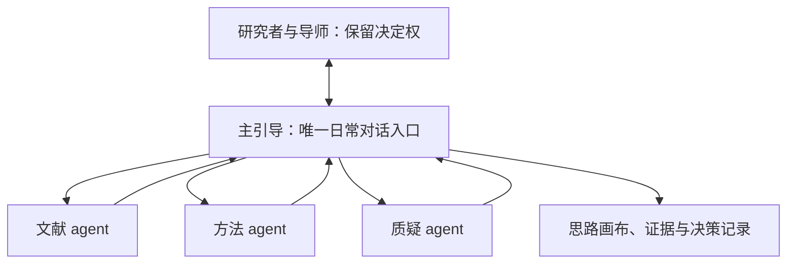

# 蛋挞博士研究工作台

**思维优先，决策在人。** 先理解研究者的资料、资源和困惑，再通过追问、证据与不同解释帮助她形成自己的科学问题。

本仓库是可下载的科研辅助工作区：包含主引导 skill、九个固定版本科研 skills 、女娲专家蒸馏 skill 及一个共享支持包、三个专家子 agent 配置和空白模板。它需要支持文件与工具的 AI 客户端运行，不是独立网页应用。

## 快速开始

1. 下载完整仓库或克隆，保留隐藏目录 `.codex/`。
2. 首次先运行 `python3 scripts/start_project.py`，在不受 Git 跟踪的 `.local/research-workbench/` 创建自己的工作副本；也可用 `--dest` 指定仓库外的新目录。
3. 在 Codex 打开新副本，阅读 [00_从这里开始.md](00_从这里开始.md)，复制其中的启动语。
4. 如要多 agent 协作，再复制 [05_多Agent使用指南.md](05_多Agent使用指南.md) 的启动语。客户端没有相应工具时明确退回单 agent 分角色分析。

没有 Python 时也可以下载 ZIP、解压到仓库之外，直接打开文件夹开始；安装见 [安装与环境指南](01_安装与环境指南.md)。本包不把安装全部科学计算库作为思考的前置条件。

## 一个对话入口，三个按需专家

| 角色 | 职责 | 不代替什么 |
|---|---|---|
| 主引导 | 理解困惑、拆任务、核对结果、与你讨论、维护记录 | 研究者与导师的决定 |
| 文献 agent | 核查原始研究、相近工作和相反证据 | 真实全文阅读与来源核验 |
| 方法 agent | 检查比较、对照、终点、研究单位和可行性 | 真实实验结果或资源确认 |
| 质疑 agent | 检查推论、反例与替代解释 | 以投票确定科学真伪 |

只有适合独立完成的问题才拆分；最多三个专家同时运行。专家默认只读，主引导统一写研究记录。多人一致不构成新增证据。



项目角色配置依据 [OpenAI 官方子 agent 文档](https://learn.chatgpt.com/docs/agent-configuration/subagents)，核对日期 2026-09-24。配置存在不代表客户端已经加载，也不等于真实多 agent 已执行；首次按指南做最小调用验证。

## 这次优化

保留更新版的 Idea 画布、关键追问和主张—证据映射，同时调整：

- 三个冻结点变为可回看的检查节点；暂定思路可以继续推演。
- 区分人的方案选择、科学证据与具体动作受阻。
- 已有证据与计划取得的证据分开，不预设根本成因。
- 检索与逐篇证据以 CSV 为正式记录，台账负责索引与综合判断。
- 多 agent 返回证据与分歧，由主引导核对，不各自问用户或改共享文件。

## 目录

- [主引导技能](skills/danta-proposal-guide/SKILL.md) 与 [协作协议](skills/danta-proposal-guide/references/multi-agent.md)
- `.codex/agents/`：三个项目级角色配置
- `vendor/skills/`：九个固定提交版本的第三方科研技能、女娲专家蒸馏 skill 及 nature-shared 支持包
- `我的开题/`：空白模板，运行时请使用本地副本
- [全周期课题助手](variants/mentor-agent/index.md)：可选的另一种工作区，包含开题后的研究推进；二选一作为主工作区
- [验证与优化说明](04_打包验证说明.md)

本仓库不含真实研究数据、私人聊天、账号配置或已启用的后台日报。日报线索只能作为待核实信息；复制工作区不会迁移已有自动化。

## 验证

```bash
python3 scripts/validate_release.py
```

测试包括完整性、安装/重复安装/冲突保护、隔离工作副本与本地链接。它不证明学术判断正确，也不替代使用者设备上的子 agent 运行验证。

第三方来源、许可证与扩展依赖见 [Skills来源与边界](03_Skills来源与边界.md) 和 [THIRD_PARTY_NOTICES.md](THIRD_PARTY_NOTICES.md)。

## v1.3 实测改进

三位独立评审分别测试用户体验、证据逻辑和安装流程，再交叉讨论。修复副本重复创建、复制范围过宽、启动顺序冲突；增加带任务ID/用户约束的交接和过时输出检查。详见 `tests/reports/v1.3-review.md`。已是副本时重复启动会恢复现有位置，不再嵌套复制；系统只复制 `project-files.json` 列出的发行文件。

## v1.4 文献探索与精读模块

新增 `codex-research`（问题驱动的文献论证）与 `nature-reader`（来源问答、按需全文读本），附 `nature-shared` 依赖。继续由主引导把握思考过程与人的决定，按当前任务加载专项模块。默认安装共11个目录，含主引导、9个科研skills和1个共享支持包。

首轮受限材料测试中三个候选都守住了关键证据边界；尚未验证新模块的真实全文检索、PDF/OCR、图像处理或自动发现。打包可用不代表这些能力已就绪。详见 [首轮测试报告](tests/reports/v1.4-skills-review.md)。

已有旧版时参照 [升级说明](01_安装与环境指南.md#h-v14-升级与新增模块)；保留真实研究资料，冲突时安装器不覆盖。

## v1.5 专家顾问蒸馏

打包原作者女娲 `huashu-nuwa` 的固定版本及配套脚本/模板。支持明确专家、模糊需求诊断、人物/主题、三个档位、本地语料和增量更新；保留调研、提炼、独立验证与双agent精炼检查点。当前默认共12个安装目录。

从 [蒸馏专家做顾问](06_蒸馏专家做顾问.md) 开始。六维调研服从客户端并发上限，生成的顾问和语料仅保存在私有工作副本；本发行包没有预置或声称完成任何真实专家蒸馏。
