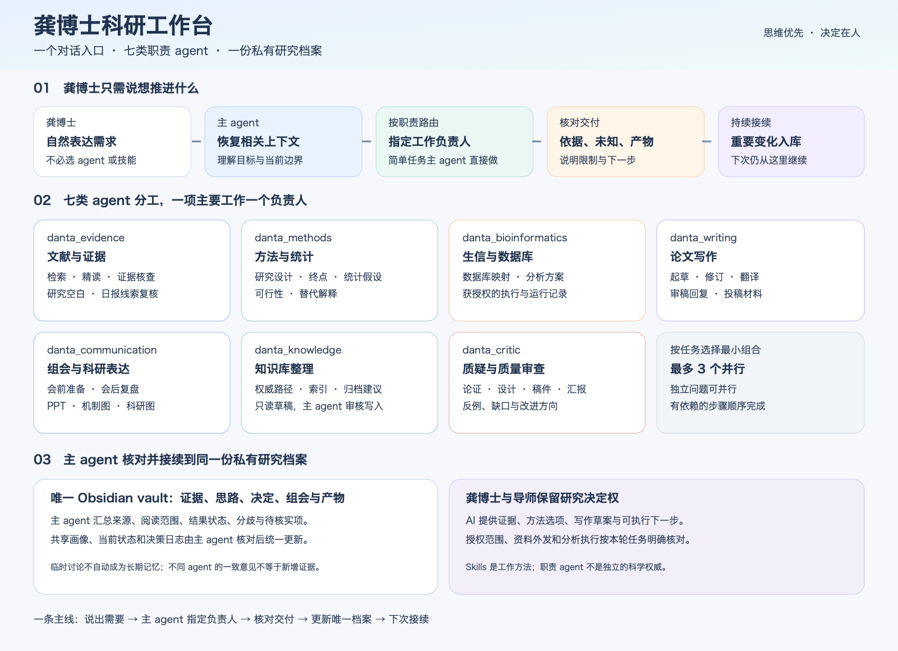

# 龚博士科研工作台

**面向使用者的介绍：** [体系、价值与逐项使用说明](docs/architecture/2026-10-05-龚博士科研工作台体系与使用介绍.md) · [离线说明页](apps/danta-workbench-ui/public/workbench-guide.html) · [体系总览图](apps/danta-workbench-ui/public/framework-overview.svg)。本轮新增尚待发布，已安装软件以本机版本为准。

本轮实现与检查见 [2026-10-05 验收与同步报告](docs/reports/2026-10-05-本轮验收与Git同步.md)；自动测试、Windows 构建和实机界面验收分别记录。

内容体系版本见 [content-version.json](content-version.json)，与桌面版本独立。Git 同步不自动升级私有库技能；按 [内容更新说明](skills/danta-proposal-guide/references/content-updates.md) 使用只读计划、校验、备份及受管理更新。

**思维优先，决策在人。** 主 agent 是龚博士博士期间的持续科研助理与思考搭档：在她授权的工作区逐步了解资料和协作偏好，延续研究脉络，再通过倾听、证据和不同解释帮助她推进当下问题。

本仓库包含龚博士的主引导 skill、固定版本科研 skills、生物数据库查询、生物医学论文写作与修回、生物科研日报、PPT 与科研图工作流、Consensus/Semantic Scholar 检索及 PubMed Linked Discoveries 文献脉络探索、科研工具地图、PPT Master 官方固定版本安装器、女娲专家蒸馏 skill、可选职责 agent 配置、空白模板，以及可安装的 Windows 桌面工作台。桌面应用负责分流任务、整理可编辑的启动语；用户可在选定知识库后检查科研目录结构，经本人确认补齐缺失的空目录。读取 Markdown、RSS 缓存和新建归档分别按范围授权。任务交接优先接续任务关联的 Codex 对话，也可另开选定工作区的新对话；复制启动语后仍需使用者粘贴并提交。工作台不会后台扫描资料或自动运行 agent。外部检索按需调用；账号 API key 由使用者申请并在本机环境配置，不写入发行包。PPT Master 不占用日常知识库空间，第一次需要真正制图时再按校验值下载到当前私有工作区。

工作台界面原型截图（2026-09-28，本机深色模式首屏）：


[机制图工作区截图](docs/assets/mechanism-ui.png)

## 最快开始：下载一个知识库，打开两个应用

龚博士已经使用 Obsidian，并已有 `GY` 知识库。建议先让 Codex 在龚博士自己的电脑上确认 Obsidian 当前打开的 vault 是否为 `GY`，再把插件安装到这个现有库；不另建 vault，也不要求迁移旧笔记。下载 [独立知识库 ZIP](https://github.com/youir/danta-research-workbench/releases/download/v1.19.0/danta-research-vault-v1.19.0.zip) 主要用于全新使用者。主引导、思维引导、生物数据库与生物医学论文写作、生物科研日报专项技能、PPT/科研图流程、RSS 信息源、管理面板与空白模板都已附带，无须先安装整套技能。第一次要求真正制作 PPT 或科研图时，Codex 才下载安装并配置所需工具。请复制 [本机部署与首次配置](12_本机部署与首次配置.md) 的启动语。

这是默认且唯一推荐的新项目入口。需要维护发行文件、离线安装第三方 skills 或运行校验时，维护者再使用完整工作台包。已有项目应继续使用其唯一私有工作区，不要为了采用新版本复制出第二套当前记录。

## Windows 桌面工作台入口

龚博士通过 [GitHub Releases](https://github.com/youir/danta-research-workbench/releases) 中 tag 以 `workbench-v` 开头的最新版下载 Windows x64 安装包。安装后双击桌面或开始菜单图标，在独立窗口使用工作台；不必克隆源码、安装 Node.js、运行命令或打开浏览器。主导航分为今天、研究任务、文献资料、汇报制图和设置；首页优先接续任务与未完成启动语，选题、论文、PPT、组会、机制图、研究记录、文献和日报从对应工作区进入。知识库路径经本人确认后，可检查标准科研目录，只在确认后补齐空目录；读取权限逐项确认，工作台只在已授权范围读取。桌面版会在本机保存已确认的范围，重开后核对原知识库即可继续使用；目录变化时仅暂停受影响的授权。工作台可读取本机 Codex 项目并创建、打开新对话，启动语复制到剪贴板后由使用者粘贴、检查和提交。正式桌面版自动将任务、页面、草稿和交接状态保存到本机应用数据，关闭前等待保存；保留最近版本和最多 10 份历史备份，可在“设置 → 任务备份”恢复。顶部“检查更新”查询桌面版发布记录并提供安装包下载。完整安装、数据边界和维护流程见[桌面版说明](apps/danta-workbench-ui/README.md)。

## 完整工作台（维护者/按需扩展）

1. 从 release 下载完整 ZIP 或克隆仓库，保留隐藏目录 `.codex/`。
2. 首次先运行 `python3 scripts/start_project.py`，在不受 Git 跟踪的 `.local/research-workbench/` 创建自己的工作副本；也可用 `--dest` 指定仓库外的新目录。
3. 在 Codex 打开新副本，阅读 [00_从这里开始.md](00_从这里开始.md)，复制其中的启动语。
4. 只有任务确实需要时，再看 [安装指南](01_安装与环境指南.md)、[多 agent 指南](05_多Agent使用指南.md) 或 [GitHub 扩展候选](11_GitHub扩展候选与试用标准.md)。主引导是唯一入口，专项 agent 按任务负责交付；简单任务仍由主引导直接完成。

选择完整工作台时，Python 用于创建隔离研究副本和运行维护脚本；日常思考不要求先安装科学计算库。知识库独立 ZIP 可直接打开，不需要 Python。

## 一个对话入口，专家按需加入

科研咨询、论文搜索或生成生物科研日报时，主引导会按任务使用 Consensus、Semantic Scholar 和其他可用来源召回信息；若当前客户端已连接 Jev MCP，公开结果达到条件后会自动重排或核验，无需龚博士点名。Jev 是检索后的辅助层，不搜索网页、不写结论；私有研究资料默认不发送，排序也不代表证据质量。不可用时原流程照常进行。整理已有 Zotero 文献时，优先评估现成插件的“预览—核对—应用—撤销”流程，不把检索排序直接写入文献库。配置边界和触发条件见主引导的 `references/jev-search-integration.md`，取舍和后续试点见 [`Jev 科研接入优化计划`](docs/2026-09-30_Jev科研接入优化计划.md)。

| 角色 | 职责 | 不代替什么 |
|---|---|---|
| 主引导 | 理解困惑、拆任务、核对结果、与你讨论、维护记录 | 研究者与导师的决定 |
| 文献证据 agent | 文献检索/精读、证据核查、研究空白与日报线索复核 | 把未读全文说成已核查，或替龚博士选题 |
| 方法统计 agent | 研究设计、终点、统计假设、可行性 | 真实实验结果、样本量或资源确认 |
| 生信数据库 agent | 数据库映射、生信方案与获授权分析执行 | 未获授权读取数据或运行分析 |
| 论文写作 agent | 生物医学论文起草、修订、翻译与投稿材料 | 补造结果、引文或替作者作决定 |
| 组会科研表达 agent | 组会准备/复盘、汇报PPT与科研图 | 虚构反馈、把假说包装成结果 |
| 知识库整理 agent | 权威路径定位、索引维护建议和长期记忆草稿 | 未经确认写入共享研究状态 |
| 质疑审查 agent | 对重要论证、方法、稿件和汇报找反例与缺口 | 以多数票决定科学结论 |

主引导先理解需求并指定负责人；只有独立子任务才并行，单轮最多三个。Skills 提供工作方法，agent 负责特定工作；共享档案由主引导核对后统一更新。



[查看原图](docs/assets/architecture.png) · [架构说明与可编辑图源](08_完整体系架构.md)

项目角色配置依据 [OpenAI 官方子 agent 文档](https://learn.chatgpt.com/docs/agent-configuration/subagents)，核对日期 2026-09-24。配置存在不代表客户端已经加载，也不等于真实多 agent 已执行；首次按指南做最小调用验证。

## 这次优化

保留更新版的 Idea 画布、关键追问和主张—证据映射，同时调整：

- 三个冻结点变为可回看的检查节点；暂定思路可以继续推演。
- 区分人的方案选择、科学证据与具体动作受阻。
- 已有证据与计划取得的证据分开，不预设根本成因。
- 检索与逐篇证据以 CSV 为正式记录，台账负责索引与综合判断。
- 多 agent 返回证据与分歧，由主引导核对，不各自问用户或改共享文件。

## 目录

- [主引导技能](skills/danta-proposal-guide/SKILL.md) 与 [协作协议](skills/danta-proposal-guide/references/multi-agent.md)
- [生物数据库查询技能](skills/danta-bioservices/SKILL.md) 与 [生物医学论文写作/修回技能](skills/danta-bio-paper-writing/SKILL.md)
- [生物科研日报技能](skills/danta-bio-daily-briefing/SKILL.md)：把已授权/可用来源压缩为带证据状态、覆盖范围和链接的离线 HTML 简报。
- [KimiWork 任务接力 SOP](16_KimiWork任务接力SOP.md)：合规任务在 Codex/WorkBuddy 与 KimiWork 之间接力——「切换kimi」生成交接记忆文档，「切换kimi完成」读取回传文件核查后继续。
- `.codex/agents/`：项目级职责 agent 配置；单轮最多三个并行
- `vendor/skills/`：九个固定提交版本的第三方科研技能、女娲专家蒸馏 skill 及 nature-shared 支持包
- `我的开题/`：空白模板，运行时请使用本地副本
- [科研工具地图](我的开题/02_盘点/科研工具地图.md)：按当前研究问题筛选候选工具，并将实际环境能力单独核验
- [全周期课题助手](variants/mentor-agent/index.md)：可选的另一种工作区，包含开题后的研究推进；二选一作为主工作区
- [GitHub 扩展候选与试用标准](11_GitHub扩展候选与试用标准.md)：近期项目、许可核查和按需试用流程
- [本机部署与首次配置](12_本机部署与首次配置.md)：复制给 Codex 的部署说明
- [P1 前端架构重构优化报告](docs/reports/P1架构重构优化报告.md)：记录界面拆分、性能调整与后续改进方向
- [科研汇报与可编辑PPT指南](13_科研汇报与可编辑PPT指南.md)：组会/开题PPT、机制图、流程图、实验设计图与病理图版
- [验证与优化说明](04_打包验证说明.md)

本仓库不含真实研究数据、私人聊天、账号配置或已启用的后台日报。科研日报按需生成；其线索需回到原始来源核实，复制工作区不会迁移已有自动化。

## v1.12 PPT Master 与科研图

增加 PPT Master v6.6.0 官方压缩包 SHA-256 校验安装器，第一次制图时才下载到当前私有知识库，保留其完整性/归属检查和上游文件，不把 62 MB 的包塞进日常库。PPT 与独立科研图统一走主引导，支持机制图、流程/实验设计图、病理图版和真实数据图；增加机制关系来源表、图例语义、模型语境、已完成/计划状态、真实图像与定量数据边界，以及科研图索引和模板。默认禁用上游在线研究、搜图和生成式配图。

## v1.13 Obsidian 信息源与管理面板

增加 RSS/Atom 信息源插件和只读工作台面板。信息源支持手动或可选定时更新、来源分组、未读/收藏、搜索、OPML 导入导出与人工复核后存入知识库；面板汇总库内待跟进记录、RSS 线索和最近更新。两款插件面向现有 `GY` vault 部署，新空白 vault 模板也已包含插件。默认不订阅来源、不自动更新、不抓取全文、不上传笔记；部署时仅确定 vault 路径并安装插件，初始资料扫描必须另外取得龚博士本人授权。

## v1.14 生物医学数据库、论文写作与科研图

新增两个工作台原创 Codex skills：跨数据库查询/标识符映射，以及生信论文与分析协作。主引导依据自然语言任务按需调用；R/RStudio 环境检测不等于运行授权，分析后端与数据范围需分别确认。论文图稿接入既有 PPT Master/科研图流程，涵盖机制关系证据状态、组学流程和真实病理图像质检。没有复制 Codar 插件或许可不清的论文 skill 源码；数据库 Python 包、R 环境和 BioRender 仍需用户单独选择与配置。

## v1.15 生物科研日报

新增按需触发的生物科研日报技能：参考 [kawaiier/daily-brief](https://github.com/kawaiier/daily-brief) 将来源收集、结构化内容与 HTML 呈现分开，并采用短清单、不凑数、来源可追溯和明确空状态。使用已有 RSS/Atom 信息源，不假设日历、邮件或聊天已连接；不订阅新源、不开启更新或创建定时任务。日报可附一条组会讨论问题，但只从实际文献线索提出，不代写未提供的会议事项。输出为私有知识库中的每日独立 HTML 文件。

## v1.16 生物医学论文写作与修回

升级 `danta-bio-paper-writing` 为龚博士的轻量论文协作者，覆盖中英文起草/修改、摘要与章节、图注、全文逻辑检查、审稿意见回复和投稿材料。她可以用“帮我改摘要”或“看看这条审稿意见”这类短指令启动；助手先从已授权的 GY 知识库、当前稿件和已确认的偏好恢复相关上下文，只追问会改变科学判断的缺项。简单编辑直接交付，长稿才先对齐论证提纲和证据缺口。

吸收本机生信技能库中“结果问题—证据—图表映射”、方法复现要素和报告规范缺项分类；不沿用固定服务菜单、默认整套分析/制图、长篇 PRD 审批或特定 Codar 服务器导出依赖。写作不自动触发数据分析、扫描未授权目录或科研图生成；这些仍由对应工作流按需处理。论文写作偏好模板留空，待龚博士在实际协作中逐步确认。

## v1.10 易用性与架构收敛

新手默认下载独立 Obsidian vault ZIP，不需安装第三方 skills；主 agent 根据自然语言请求选用思考与开题、持续研究或组会写作路径。Codex 和 Obsidian 共用唯一私有 vault，技能、专家和外部服务仅按需开启。初始资料扫描需龚博士本人先授权指定范围，摘要带来源并待她核对。框架图已换成可编辑 SVG 与同步 PNG；候选扩展页记录许可和评估状态。

## v1.11 科研汇报与可编辑 PPT

v1.11 提供组会/开题/阶段汇报工作流。v1.12 将制图引擎更新为 PPT Master；v1.11 的 `presentation-skill` 作为历史发行依赖，不再是当前推荐引擎。

## 验证

```bash
python3 scripts/validate_release.py
```

测试包括完整性、安装/重复安装/冲突保护、隔离工作副本与本地链接。它不证明学术判断正确，也不替代使用者设备上的子 agent 运行验证。

第三方来源、许可证与扩展依赖见 [Skills来源与边界](03_Skills来源与边界.md) 和 [THIRD_PARTY_NOTICES.md](THIRD_PARTY_NOTICES.md)。

## v1.3 实测改进

三位独立评审分别测试用户体验、证据逻辑和安装流程，再交叉讨论。修复副本重复创建、复制范围过宽、启动顺序冲突；增加带任务ID/用户约束的交接和过时输出检查。详见 `tests/reports/v1.3-review.md`。已是副本时重复启动会恢复现有位置，不再嵌套复制；系统只复制 `project-files.json` 列出的发行文件。

## v1.4 文献探索与精读模块

新增 `codex-research`（问题驱动的文献论证）与 `nature-reader`（来源问答、按需全文读本），附 `nature-shared` 依赖。继续由主引导把握思考过程与人的决定，按当前任务加载专项模块。默认安装共11个目录，含主引导、9个科研skills和1个共享支持包。

首轮受限材料测试中三个候选都守住了关键证据边界；尚未验证新模块的真实全文检索、PDF/OCR、图像处理或自动发现。打包可用不代表这些能力已就绪。详见 [首轮测试报告](tests/reports/v1.4-skills-review.md)。

已有旧版时参照 [升级说明](01_安装与环境指南.md#h-v14-升级与新增模块)；保留真实研究资料，冲突时安装器不覆盖。

## v1.5 专家顾问蒸馏

打包原作者女娲 `huashu-nuwa` 的固定版本及配套脚本/模板。支持明确专家、模糊需求诊断、人物/主题、三个档位、本地语料和增量更新；保留调研、提炼、独立验证与双agent精炼检查点。当前默认共12个安装目录。

从 [蒸馏专家做顾问](06_蒸馏专家做顾问.md) 开始。六维调研服从客户端并发上限，生成的顾问和语料仅保存在私有工作副本；本发行包没有预置或声称完成任何真实专家蒸馏。

## v1.6 科研 OGSM

新增 [科研 OGSM 使用指南](07_科研OGSM使用指南.md)：选题前轻量比较，方向确定后将证据目标、研究策略、追踪与调整条件整理成一页纸。主引导按需加载，无新增安装依赖；科学判断和选题仍由蛋挞与导师决定。

[查看完整体系架构（含 OGSM、Obsidian 与长期记忆）](08_完整体系架构.md)。

## v1.7 科研知识库

新增独立 Obsidian vault 模板、受保护的初始化器、路径映射与结构检查。主引导识别新库，在新路径维护唯一研究记录；不覆盖已有 Obsidian 配置，不复制 hwm 私人内容。

## v1.8 组会与持续研究

新增 [组会指南](10_组会与持续研究指南.md)：文献/选题/方案/进展/困难/预答辩按需组织，会前讨论单、PPT提纲与口头摘要、会前核查和会后写回。文献增量更新同一台账，9张写作审查卡按阶段启用。无新增定时任务，默认交付Markdown讨论包而非已生成PPT。

## v1.9 龚博士的持续科研助理

主引导以“龚博士”为称呼，作为她博士期间的持续科研助理和思考搭档；增加资料来源/确认状态、研究与协作偏好记录及隐私边界，要求在授权工作区恢复上下文、逐步了解而不反复问卷，并按她当下需要调整倾听、引导或直接解题的方式。初始化信息标为准备者提供、待本人核实；不伪造她的个人研究事实。
