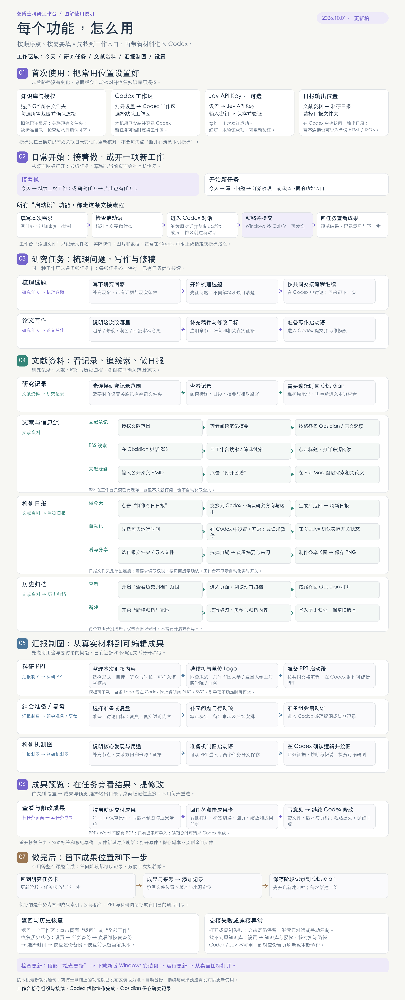

# 工作台功能使用说明

日期：2026-10-01。按本机最新功能绘制，Windows 安装版以已发布版本为准。本轮自动备份、原对话接续和成果预览功能尚待发布后安装使用。

[打开高清 PNG](../assets/quickstart.png) · [可编辑 SVG](../assets/quickstart.svg)

## 阅读顺序

1. **首次设置**：连接 GY、确认所需范围、选择常用 Codex 工作区；Jev 连接按需配置。日报文件夹单独连接，并在 Codex 中核对输出位置。
2. **日常开始**：从“今天”继续上次工作，或从对应工作区开启新任务；已有关联对话时优先接续。
3. **研究任务**：梳理选题和论文写作。填写本次目标与真实材料，生成启动语，进入 Codex 粘贴并提交。
4. **文献资料**：查看研究记录、文献笔记、RSS 与 PubMed 文献图谱；制作今日日报，向 Codex 发出自动化设置或暂停请求；查看日报后导出长图；按需要查看或新建归档。
5. **汇报制图**：PPT 先填汇报需求、选模板和单位 Logo，再交接；组会选择准备或复盘；机制图先整理关系、来源和证据，再在 Codex 中确认与制作。
6. **成果预览**：先在设置连接成果输出目录，按启动语让 Codex 保存原件、预览件和成果清单；回原任务点击成果卡，右侧看文件、切标签、翻页或放大。填写意见后点“继续 Codex 修改”，在原对话粘贴并提交；新版交付后回任务刷新。已有成果可导入该目录内的原件，缺少 Office 预览时另选同版本 PDF。
7. **完成与恢复**：回任务卡登记来源、状态和下一步；需要时保存阶段记录到 Obsidian。重开恢复任务、预览标签及意见；返回、历史备份恢复、连接异常与软件更新分别有对应入口。

## 容易混淆的操作

- 工作台“添加文件”只记录文件名，实际材料需在 Codex 中附上或指定获授权位置。
- “导入已有成果”用于实际本机预览；它和“添加工作文件”不同，只能选择已启用成果目录内的文件。关闭预览标签不会删除原件。
- 启动语不会自动发送；进入 Codex 后需粘贴并提交。
- RSS 在 Obsidian 中更新，工作台只展示已有缓存。
- 科研日报自动化由 Codex 管理，工作台不显示未经核实的实时开关状态。
- 查看归档和新建归档是两个独立范围；保存阶段记录不会覆盖原研究文件。
- 知识库位置与关联未变化时，正式桌面版自动核对并恢复原授权；日报目录可能另需按提示确认读取。

## 维护依据

根据当前导航、功能组件及桌面版说明核对按钮与入口。`docs/assets/quickstart.png` 保持固定地址，前端顶部“使用说明”继续打开此图；SVG 用于后续编辑，不新增临时生成脚本。
