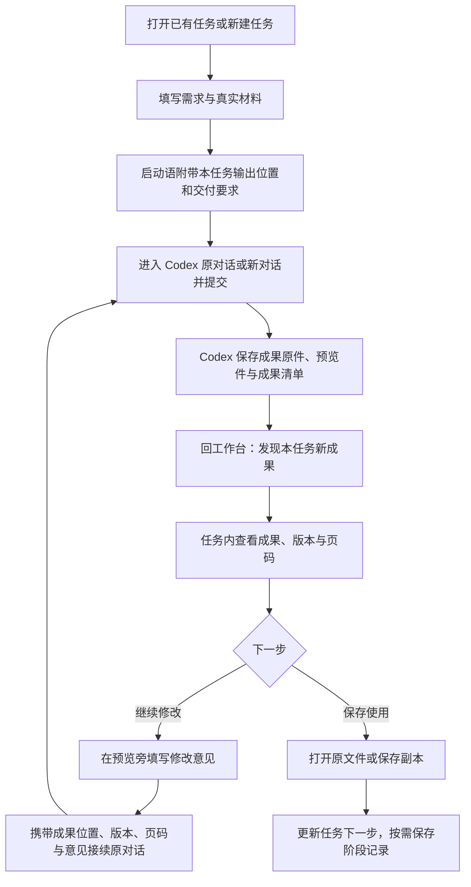

# 成果预览与修改接续规划

日期：2026-10-01。状态：首版已接入本机源码；桌面构建通过，尚未完成 Windows 实机全流程验收与发布。针对当前工作台的任务卡、成果与来源索引、本机桥接、原对话接续及磁盘恢复能力设计。

首版实现见 `apps/danta-workbench-ui/server/artifactService.js` 与 `src/features/artifacts/`：成果目录设置、任务清单读取、原生导入与预览件关联、文件面板、修改交接及任务内阅读状态保存。PPTX/DOCX 以配套 PDF 或单张图片预览；多页图片集合与本机 Office 转换暂未接入。隔离 HTML 暂不恢复内部滚动位置。任务备份保存面板与意见，目录授权及手动文件关联独立保存在本机连接记录中，不随任务 JSON 导出；跨电脑需重新关联文件。以下保留总体设计与后续验收目标。

## 1. 要改善的实际使用路径

龚博士在工作台整理任务，进入 Codex 制作后，还需要在 Codex 或文件夹找结果，再回工作台手工登记位置。只增加空预览窗口不能解决问题，必须同时建立“任务 → 输出位置 → 成果文件”的关联。

目标路径：



查看、翻页、切换版本和整理修改意见在工作台完成。第一版提交修改仍使用既有 Codex 交接；不把“复制意见”显示为“已发送”，不从文件变化推断 Codex 正在运行或研究已完成。

## 2. 采用 Codex 式文件面板

按用户补充，交互参考 Codex 的文件面板：在当前任务旁打开文件，用标签切换成果。保留现有五个主导航，成果入口放在所属任务内。默认不切换整个任务页面，填写需求、查看结果和记录意见在同一个工作区完成。

这里借鉴的是“任务旁打开文件”的交互组织。下述标签规则、状态恢复和反馈安排是本工作台的设计方案，不代表 Codex 已具备所有这些行为，也不意味着工作台能嵌入 Codex 的私有面板。

```text
主导航       当前研究任务                   成果面板（可拖动分隔线）
             任务名称 · 继续 Codex          汇报 v2 × | 机制图 v1 ×
             需求与材料                    文件名 · 版本 · 预览状态
             当前进展与下一步              翻页 / 缩放 / 展开 / 收起
                                          ┌──────────────────────┐
             成果 · 3                     │ PDF / 图片 / 文字     │
             [汇报 v2] [机制图 v1]         │                       │
             [论文草稿]                   └──────────────────────┘
             历史版本（展开）              打开原件 · 保存副本
                                          第 3 页，本次想怎么改？
                                          [意见草稿]
                                          继续 Codex 修改
```

### 打开、切换与关闭

- 点击任务里的成果卡，右侧打开对应文件；再次点击同一成果版本只聚焦已有标签，不重复打开。不同版本可以各占一个标签，标签名称明确版本。
- PDF、图片、文字和报告共用同一个面板外壳，内部工具随格式变化。标签附带关闭按钮，关闭视图不会删除成果或意见草稿。
- 面板支持拖动调整宽度、展开为工作区大预览，以及收起回任务；展开时给出清晰的“返回任务”。首版默认右侧，暂不增加方向布局设置。
- 有新成果时提供“查看新成果”提示，点击后才打开文件，不抢占当前标签、翻页位置或正在填写的任务。
- 窄窗口使用覆盖工作区的文件视图，保留“返回任务”；意见区可折叠，不把任务表单、预览和反馈挤成三列。
- 顶部“继续 Codex 修改”沿用现有交接能力：实际复制与打开结果逐项说明，并提示粘贴提交。不能将打开面板或复制文本显示为已执行修改。

### 记住上次查看状态

- 按任务保存打开的成果标签、当前标签、面板宽度、展开/收起状态、各文件的页码、缩放与阅读位置，以及意见草稿；切换任务时恢复对应任务的面板，不混入其他任务文件。
- 同一成果新版本有独立阅读位置；原件/预览件变化时核对文件身份，页数减少则调整页码。失效标签保留名称与“文件不可用”提示，提供重新定位入口，不自动扩大授权。
- 关闭软件重开后恢复原任务及面板。仅保存文件标识与视图状态，文件内容通过已有本机授权重新读取。
- 空状态只给一个主要动作：未绑定目录时“设置成果位置”；已绑定但无文件时“导入已有成果”。说明下一次交接将带入输出要求。
- 当前使用版本和历史版本在列表中区分。发现新文件只标为“新成果 / 本次输出”，正式采纳由使用者自行决定，不增加必填审核步骤。

## 3. 成果如何进入工作台

### 首次设置一次，日常不再挑文件夹

设置增加“成果与预览”。龚博士选择实际成果输出根目录，确认工作台可读取这里的成果；可以使用 GY 内现有的 `08_成果输出_Outputs`，也可以选择其他现有输出目录。具体地址只存本机，不写 Git。

已有“研究记录”等授权只覆盖原范围，不能自动扩展成二进制成果读取；首次开启成果预览说明新增范围并确认一次。此后同一路径与关联保持有效时自动恢复，不逐文件反复授权。成果目录与知识库连接分别维护，不因未连接 Obsidian 而阻止已授权成果预览。

每项任务分配稳定的输出子目录标识。启动语包含完整输出位置、任务编号和交付要求；Codex 在其已获授权范围内创建对应任务目录并保存成果，工作台自身只读成果。目录不存在时显示“尚未生成”，不假装已保存。实际路径须在交接时明确，不能只传文件夹名称。

### 新任务：固定交付约定

Codex 交付内容包含：

1. 成果原件：PPTX、DOCX、SVG、PNG、Markdown 等。
2. 适合预览的配套文件：例如 PPTX 对应 PDF 或分页 PNG。
3. 小型成果清单：任务编号、稳定成果 ID、名称、类型、版本、原件相对路径、预览件相对路径、生成时间；前一版 ID 与来源摘要在已知时填写。

原件和预览件要属于同一版本；预览无法生成时明确记录缺失，不拿旧预览冒充新成果。模型写出的清单只是候选索引，本机桥接仍需核对任务编号、实际文件是否存在、路径范围和类型。跨任务或不匹配的记录不自动混入当前任务。

新版本使用新文件名，保留旧版。工作台索引清单，不复制整份研究资料，也不重新建立第二套知识库。

### 已有成果：兼容入口

“导入已有成果”通过系统文件选择器选原件及可用预览件，建立本机索引并关联任务，不移动原件。已有“成果与来源”的文件位置保留；只有能确定属于已授权输出范围时才尝试关联预览，否则提供选文件操作。仅凭旧文件名不足以推断完整路径。

## 4. 第一版格式范围

| 成果 | 工作台如何预览 | 缺少预览件时怎么办 |
|---|---|---|
| PNG / JPEG / WebP | 直接显示，支持缩放 | 文件异常时提示并保留打开原件入口 |
| SVG 科研图 | 以隔离的图片方式呈现，不执行脚本 | 不兼容时由生成流程附带 PNG |
| PDF | PDF.js 本地翻页、缩放，记住页码 | 密码保护、过大或解析失败时给出实际原因 |
| Markdown / TXT | 本机文字阅读；Markdown 渲染禁止原始 HTML 执行 | 无法解析时显示纯文本 |
| 离线 HTML 日报 / 报告 | 隔离预览，不运行脚本或请求远程资源 | 依赖脚本或外链的内容标明不能完整展示 |
| PPTX | 原件保留，预览同版本 PDF / 分页 PNG | 显示“缺少预览件”，提供生成预览的接续请求 |
| DOCX | 优先预览同版本 PDF；文字草稿可另附 Markdown | 显示“缺少预览件”，保留原件打开入口 |

PPTX 和 DOCX 的排版不能用不准确的简化渲染冒充原件。优先在原生成步骤一起产出预览，减少龚博士手工转换。转换依赖不可用时说明情况，提供有实际内容的降级结果。后续根据使用频率再考虑本机 Office/WPS 转换适配、表格预览或版本并排对比。

## 5. 修改与保存

在文件面板内填写自然语言意见，如“第 3 页标题太长，保留数据图，缩短下面的解释”。可用当前 PDF 页码辅助定位；不要求学习绘图批注工具。意见按成果版本保存；输入后翻页不会悄悄更改已记录的页码，允许继续补充其他页的意见。切换标签或收起面板不会丢失草稿。

点击“继续原对话并复制修改意见”后，交接包含：任务编号、选中成果 ID、原件和预览件位置、版本、页码与意见，要求在原件基础上制作新版本并同步预览件。沿用现有失败保留与原对话机制，打开失败不会丢意见。

文件更新后，任务页进入前台时检查清单变化；提供“刷新”作为明确后备。只在成果预览启用期间检查已授权的任务位置，不常驻扫描整个 GY。首版采用可控的前台增量检查，后续确有实时需求再加入文件监听。

“保存副本”选择目标位置，不静默覆盖；“打开原文件”调用本机关联程序。原件仍在研究目录，预览缓存可重建。任务备份保存成果索引和界面位置，不嵌入大型 PDF/PPTX，不将缓存当作研究原件。

## 6. 技术复用与边界

- 复用现有任务卡、成果与来源索引、`useResearchTasks`、本机桥接、Codex 交接和磁盘状态恢复，不增加新的主导航或独立研究数据库。
- PDF 预览采用 [Mozilla PDF.js](https://mozilla.github.io/pdf.js/getting_started/)，安装包内置必要文件，不通过公网 CDN 加载研究内容。
- 离线 HTML 采用有 sandbox 限制的 iframe。Electron 官方说明 iframe 可用 sandbox 限制能力，同时[不推荐使用 webview](https://www.electronjs.org/docs/latest/tutorial/web-embeds/)；本方案不引入 webview 或打开 Node 权限。
- DOCX 转 HTML 可使用已有项目，但 [Mammoth 明确说明不负责净化输出](https://github.com/mwilliamson/mammoth.js#security)。第一版因此优先采用配套 PDF，避免额外排版偏差与内容隔离成本。
- 新增独立成果服务模块，负责目录授权恢复、清单校验、文件索引和只读内容流；`App.jsx` 只组织状态与入口，预览组件不接收任意文件系统路径读取能力。
- 前端拆分文件面板、标签状态、格式查看器和修改意见四部分；复用现有任务磁盘恢复机制，状态以任务 ID 和成果版本 ID 关联。只加载当前标签内容，切走或关闭时释放 PDF 渲染资源与临时文件 URL；标签状态保留，不把全部文件长期驻留内存。
- 预览接口使用已验证的成果标识；每次读取核对真实路径、关联目录与文件身份，拒绝越界和指向范围外的符号链接。原有本机来源限制继续有效。
- 文件数量、体积、图片像素和 PDF 解析时间设上限；大文件先展示元数据和打开原件入口。远程图片、脚本和附件不能借预览读取其他文件或外发研究内容。
- 文件读取失败、原件移走、预览过期、不同版本不匹配分别说明。仅受影响的文件或关联暂停，保留其他有效授权与任务草稿。

## 7. 实施顺序

1. **交付约定与数据兼容**：确定成果清单、任务关联、原件/预览件关系及版本字段；保留旧任务与索引。
2. **本机读取与设置**：成果位置选择、确认一次后恢复、路径校验和只读内容接口。先使用仓库外模拟输出验证，不访问 GY 私有资料。
3. **任务内文件面板**：先连通“点击成果 → 右侧打开 → 标签切换 → 收起/展开 → 返回任务”，再接入图片、PDF、文字与隔离 HTML；补上导入、缺失预览和原件打开入口。
4. **生成与修改接续**：启动语加入交付要求；前台检查新成果；预览旁的意见带入原对话；新版本同时更新预览。
5. **恢复与交付检查**：切换任务和关闭重开恢复各任务的标签、选中成果、页码、缩放、阅读位置及意见；成果范围有效时不重复授权；旧任务导入和任务备份保持兼容。
6. **Windows 验收与发布**：验证真实本机生成、预览、修改、新版本与重开路径，再更新使用说明和安装包。

## 8. 验收标准

- 从工作台启动制作后，只需回到原任务即可找到成果，不需要再翻 Codex 文件列表。
- 点击成果即可在当前任务旁查看；重复点击不新增标签，关闭标签不删除文件，展开后能返回任务。新成果提示不打断填写和阅读。
- PPT 和论文能预览同版本内容，并能找到可编辑原件；预览缺失或过期时有明确提示。
- 修改意见自动携带文件、版本和页码，且继续同一研究对话；失败后意见仍保留。
- 切换任务不串文件；关闭重开后仍在原任务，可恢复打开的标签、所选成果、阅读位置与未提交意见；有效成果目录授权不重复要求。
- 图片、PDF、文字、HTML、原件移走、损坏文件、不同任务清单、越界路径、符号链接、大文件与缺少转换依赖都有明确处理。
- 查看成果不会修改原件，不读取未授权目录，不上传文件内容，不把“发现文件”当作研究完成。

## 决策建议

将本功能提升为下一轮第一优先：先连通任务与成果文件，再提供预览及修改接续。已有任务引导的完善可以随交付要求一起做。完全在工作台内提交 Codex 执行是另一项扩展，待第一版减少切换的效果得到实际反馈后再评估。
