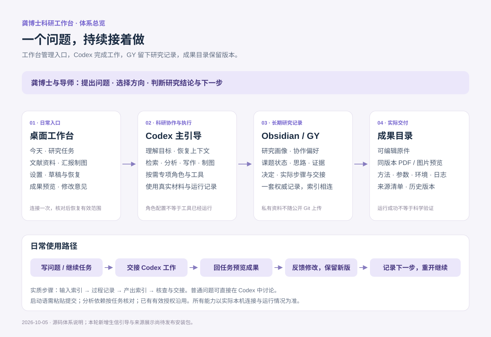

# 龚博士科研工作台：体系与使用介绍

**从一个研究问题，走到可回看的过程、可修改的成果和清楚的下一步。**

说明日期：2026-10-05。本介绍按现有源码核对。本轮新增生信材料引导、成果来源记录及说明页，尚未发布安装包；龚博士电脑上可用的内容以安装版本及实际连接状态为准。

## 1. 三分钟理解它的价值

工作台把科研中容易散落的内容连起来：今天的想法、正在推进的任务、文献依据、分析过程、汇报稿和下一步。你可以从上次停下的位置继续，也可以直接让 Codex 帮你处理一个明确问题。

| 日常遇到的情况 | 这套体系怎样帮你 |
|---|---|
| 换个对话又要解释研究背景 | 从已授权的研究记录恢复相关背景、偏好与当前课题；只补问有影响的缺项 |
| 做了很多事，却不知道下一步 | 在任务里保留本次目标、当前实际步骤、阻塞和最小下一步 |
| 找到论文，但不清楚它支持什么 | 区分线索、读过的证据、推断和假说，保留原文位置与证据对应关系 |
| 结果、脚本和汇报稿散落 | 为实际步骤保存输入、过程和产出索引；成果按任务和版本集中查看 |
| 组会需要重新整理整套资料 | 从现有任务与证据准备讨论内容、PPT 或科研图，保留可编辑原件 |
| 上次关掉后要重新找文件夹和草稿 | 正式桌面版核对并恢复有效连接与范围，同时恢复页面、任务、草稿和预览状态 |

它的价值在于研究能持续接着做：知道目前依据是什么、做过什么、哪里仍不确定、下一步怎么推进。研究结论和方向选择由你与导师决定。

## 2. 整体框架：四个部分各司其职

### 工作台：日常操作入口

独立桌面窗口，用来找到任务、整理本轮需求、选择汇报样式、看成果、写修改意见和恢复上次工作。日常只需要五个区域：**今天、研究任务、文献资料、汇报制图、设置**。

### Codex：科研助理与执行入口

你用自然语言说明需求。主引导恢复相关上下文，按需检索、分析、写作或制图；复杂任务可以使用文献、方法统计、生信数据库、写作、科研表达、知识整理和质疑检查等职责。你不需要学习角色名称或技能编号。

功能涉及文件处理、分析或制作时，Codex 使用实际可用的工具和已授权材料。配置了角色或安装了技能，并不意味着所有软件环境都已经就绪。简单问题可以直接在 Codex 中问，不需要先填卡片。

### Obsidian / GY：长期研究记录

私有知识库保存研究画像、协作偏好、课题状态、思路、文献证据、决定与实际步骤。按照已确认的路径和目录映射接入已有资料，不要求把 GY 改成新的固定名称。

每个课题只有一套权威状态、证据和决定；步骤目录通过索引连接它们。公开 Git 仓库保存系统规则、代码和空白模板，真实研究资料留在你的私有工作区。

### 成果目录：原件、预览与版本

按任务保存实际产物，可编辑原件与同版本 PDF / 图片配套。工作台在任务旁打开预览；分析成果可附来源与方法记录。修改时交付新版本，旧版保留。

这些部分通过任务编号、步骤键、来源索引和成果清单接续。工作台不是 Codex 的完整聊天镜像；知识库是研究记录，成果目录是实际交付，两者通过索引联系。

## 3. 五个工作区域，分别用来做什么

| 区域 | 什么时候打开 | 你做什么 | 得到什么 |
|---|---|---|---|
| 今天 | 刚打开，或暂时没有完整想法 | 继续上次任务，或写下今天的问题 | 一个可继续讨论的入口，保留想法草稿 |
| 研究任务 | 推进选题、研究方案、分析或论文 | 说明本次目标，接续当前实际步骤 | 持续任务、过程记录、产出和下一步 |
| 文献资料 | 找依据、看动态、整理记录 | 查看文献笔记、研究记录、RSS、日报或归档 | 来源清楚的资料入口与待核实线索 |
| 汇报制图 | 准备组会、PPT 或科研图 | 说明要讨论什么、面对谁、希望如何呈现 | 可编辑汇报/图稿、同版本预览及修改接续 |
| 设置 | 首次连接或需要维护时 | 管理知识库、Codex、成果目录、Jev 和备份 | 清楚的连接状态与集中维护入口 |

### 今天：从一句话开始

可以写：“接着上次的研究方案，帮我找出目前最缺的证据。”也可以写一个尚未想清楚的问题。点击“开始梳理”，整理启动语并进入 Codex 讨论。已有任务优先继续，避免为同一件事不断新建任务。

### 研究任务：把长工作拆成真实的小步

任务卡保留目标、阶段、进度、下一步、待解决问题、成果/来源索引和关联 Codex 对话。

本轮要实质处理材料、分析或制作成果时，可添加一个“当前实际步骤”。进入 Codex 后才建立知识库步骤记录；前端草稿不代表文件已经创建。

每个实际步骤保留：**输入索引 → 过程记录 → 产出索引 → 核查与交接**。只为当前开始的工作创建步骤；普通交流无需建文件夹。步骤完成不自动等于整个课题完成。

本轮新增的“涉及生信材料？补充线索”可选填写六类信息：材料位置或公开编号、物种、参考版本/处理层级、样本与分组、比较目标、期望产物，并选择手头材料类型。已有记录先沿用；填写本身不会读文件或运行分析。

### 文献资料：让信息进入研究，而不是堆积收藏

可查看已授权的研究记录、文献笔记、RSS 缓存和历史归档；通过公开论文线索继续查找文献及关联引文。阅读时保留“从哪里看到、读到什么程度、支持或反对哪个判断”。

科研日报用于发现与你关注方向有关的动态；可以发起“制作今日日报”，导入或读取已生成的 HTML / JSON，并制作可分享的长图。日报仍是研究线索，关键结论需要回到原始来源。

RSS 更新由 Obsidian 插件负责，工作台展示已有缓存。日报定时任务由 Codex 管理，工作台提供设置/暂停引导；实时开启状态要到 Codex 确认。

### 汇报制图：先明确讨论目的，再制作

PPT 可选择四种有排版差异的科研样式，选择海军军医大学或复旦大学上海医学院标识，也可提供自己的 Logo。填写汇报形式、目的、听众与预计时长，并说明“本次要讲什么、希望大家讨论什么”。

组会准备侧重现有依据、争议和希望导师帮助判断的问题；会后复盘侧重实际反馈、决定和下一步。PPT 与机制图通过 Codex 按需制作，交付可编辑原件；真实病理图像和数据来自实际授权材料。

机制图先整理实体、关系、方向、来源和证据状态，再生成图稿。假说关系与已有证据应能区分，不用漂亮图形替代研究依据。

### 设置：平时少打开，维护时集中处理

知识库与读取范围、目录匹配/安全补齐、Codex 工作区、成果输出位置、Jev API 设置以及状态备份集中在这里。

正式桌面版在相同知识库和范围仍有效时自动恢复。移动目录、范围扩大、路径身份不一致或主动撤销时，才处理相关连接；不会为了重开窗口让你重新授权整套内容。

Jev 绿灯表示最近一次真实连接核验成功，并显示时间；红灯表示未配置或核验失败。它适合帮助筛选公开搜索候选和相关线索；工作台配置成功不自动证明 Codex 的 Jev 接口也已配置，私有研究材料默认不发送。

## 4. 成果预览：看、改、保留版本

1. 在“设置”连接一次成果输出目录。
2. 在对应任务交接给 Codex，启动语会带上任务输出位置和交付约定。
3. Codex 保存原件、同版本预览和成果清单后，回到原任务点“刷新成果”。
4. 点击成果卡，在右侧看 PDF、图片/SVG、Markdown、文本或静态 HTML；可展开窗口、切标签、翻页或调整显示。
5. 需要修改时在预览旁写意见，点击“继续 Codex 修改”，在 Codex 中粘贴并提交。
6. 新版保存后回任务刷新，查看新旧版本；必要时“打开原件”或“保存副本”。

PPTX / DOCX 在工作台查看配套 PDF，原件通过关联软件打开。HTML 以受限制的静态预览显示，包含脚本的交互报告不保证完整呈现。已有成果可导入已授权成果目录内的文件，缺预览时关联同版本 PDF。

本轮新增“来源与方法”：展开后查看该版本交付时记录的输入索引、方法、参数、环境、脚本/命令、日志、运行时间、退出结果和核查说明。工作台只显示这些索引，不执行命令或自动读取输入。

记录了原件 SHA-256 时，可点击“核对当前原件”（最多 100 MB）。**运行成功、记录中的核查结果、文件内容一致，是三个不同判断。**文件一致不等于方法正确或科学结论成立。未登记来源的旧成果仍可预览，不补造过去的分析过程。

## 5. 一次完整工作的使用路径

以下是使用情境示例，不是你的真实课题、样本或已完成结果。

你有一份已获授权的病理相关研究材料，想明确现有证据能支持到哪里，并准备组会讨论：

1. **今天**：写下当前最想解决的问题；已有任务则继续上次工作。
2. **研究任务**：明确这次目标，例如“核对证据缺口并准备组会讨论”；开始“现有证据整理”这一实际步骤。
3. **Codex**：读取已授权的相关笔记与指定材料，列出已有证据、矛盾和缺口；需要新文献时检索原始来源。
4. **按需分析**：若有真实生信材料，在当前步骤补充线索；先检查输入与环境，再决定是否分析。尚未满足条件也能先完成方案或材料检查。
5. **汇报制图**：围绕“我观察到什么、依据是什么、还有哪些解释、需要讨论什么”整理内容，选择样式与单位标识。
6. **成果预览**：回任务看同版本预览，写修改意见，交给 Codex 生成新版本。
7. **收尾与接续**：把实际研究变化保存到知识库，在任务中保留下一步；需要时保存阶段快照。下次打开继续这一步。

如果你只要解释一个概念、改一段文字或看一张图，直接问 Codex 即可，不必走完上述流程。

## 6. 记忆、授权和文件分别保留在哪里

| 内容 | 保存位置与恢复方式 |
|---|---|
| 页面、任务、草稿、模板/Logo 选择、预览标签和意见 | 工作台本机状态；正式桌面版自动保存并提供历史恢复 |
| 研究背景、协作偏好、课题状态、思路、证据与决定 | 唯一私有 Obsidian / GY 工作区；Codex 按任务和授权恢复相关内容 |
| 当前实际步骤 | 活动课题的步骤目录；用任务编号与稳定步骤键匹配 |
| 原件、预览、版本清单与分析来源记录 | 本机成果目录；步骤记录链接实际位置 |
| 知识库位置与已确认范围 | 本机连接记录；重开后核对身份与目录再恢复有效范围 |
| Jev 密钥 | 桌面版使用系统加密保存；不写入公开 Git 和说明文档 |

工作台状态备份主要保护任务和界面状态，**不等于整套科研文件、密钥或授权的备份**。科研原件和知识库仍需按你的备份方式保管。阶段快照是某个时间的记录，不覆盖唯一当前状态。

## 7. 你可以直接这样说

- “继续上次的步骤，先告诉我还差什么。”
- “这篇文章能支持我的哪个判断？哪里不能支持？”
- “先核对这份矩阵的物种、样本单位和分组，给我适合的分析方案。”
- “把这次真实分析的方法、参数、环境和结果索引整理出来，不补未知信息。”
- “准备一次十分钟组会，重点讨论证据缺口，使用我选的模板和单位 Logo。”
- “第 3 页太密，保留原图，缩短解释，做一个新版本。”
- “把导师今天实际提出的意见整理成下一步行动。”
- “这次只改这段文字，不需要启动完整研究流程。”

可以完全通过 Codex 对话使用科研规则和知识库；前提是已找到你的私有工作区、实际加载了体系，并有相应权限。工作台提供清晰的导航、模板选择、结果预览和恢复入口；仅同步 Git 源码不自动完成全部本机配置。

## 8. 已有能力与后续提升

已有主线包括任务接续、知识库连接与范围记忆、文献/RSS/日报入口、PPT/科研图交接、成果预览与版本修改、备份及更新维护。本轮把生信材料线索和实际分析来源接入这条主线，既可从前端使用，也可由 Codex 主引导按规则执行。

仍需明确的实际条件：

- 启动语已复制、对应 Codex 对话已打开后，你仍需粘贴并提交。
- 使用分析工具前要核对本机环境；技能文件不是已经运行的分析。
- Codex 原生自动化的实时状态在 Codex 中管理。
- 私有文件经云端模型处理时，按真实授权说明范围；“保存在本机”不等于“全部推理都在本机”。
- 某项结果是否可靠，要看实际输入、设计、方法、日志和证据，不能只看绿灯或完成标签。

下一轮优先考虑公开数据的发现/适配检查与 MultiQC 结果摘要；再根据你实际开展的任务选择单细胞或空间分析模块。它们尚未作为本轮功能交付，不需要提前安装一堆工具。

## 9. 介绍演示：建议用六分钟讲清楚

**第 1 分钟：价值。** 打开“今天”，说明可以从一句问题开始，也可以接着上次工作。重点展示减少重复说明和找材料的时间。

**第 2 分钟：分工。** 展示体系图：工作台管理入口与预览，Codex 完成讨论和实际工作，GY 保存长期研究记录，成果目录保存原件与版本。

**第 3 分钟：研究任务。** 打开一项演示任务，展示目标、当前步骤、过程记录与下一步。说明生信线索按需填写，已有信息可以直接恢复。

**第 4 分钟：文献与汇报。** 展示文献资料入口，再打开 PPT 样式和 Logo 选择；说明内容围绕组会讨论目的组织。

**第 5 分钟：成果。** 展示同版本预览、来源与方法、修改意见以及新旧版本；没有真实运行示例时明确展示的是说明格式。

**第 6 分钟：接续。** 说明关闭后保存什么、下次如何继续，以及只想直接对话时怎么用。结尾邀请她指出最常用和最麻烦的一步，后续按真实使用频率优化。

## 10. 维护与核对入口

详细规则见主引导技能、实际步骤约定及分析交付约定；界面说明随发行更新。维护者核对：主引导 `skills/danta-proposal-guide/SKILL.md`、步骤 `references/research-step-workspace.md`、分析 `references/bioinformatics-delivery.md`、前端 `apps/danta-workbench-ui/src/features/`、本机桥接 `apps/danta-workbench-ui/server/`。

本说明没有读取龚博士的私有研究库，也没有替她执行真实生信分析或更新 Windows 安装。它描述的是系统能力与使用路径，实际可用状态以她本机核验为准。
