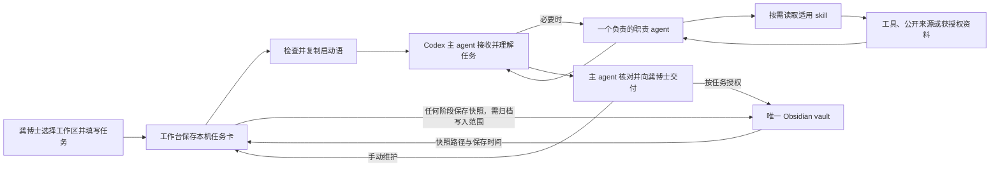

# 科研工作流与能力路由

这份说明把前端入口、项目级 agent 配置和仓库内 skill 对到一起。职责正文以 `.codex/agents/*.toml` 和 `skills/*/SKILL.md` 为准；本文件用于找入口，不替代它们。

## 一次任务如何流转

工作台与 Codex 之间通过本机桥接创建并打开对话、复制启动语；使用者仍需在 Codex 中粘贴并提交。任务卡保存任务上下文、成果与来源索引，供恢复和交接。点击保存阶段记录时，工作台通过既有归档接口新建 Markdown，并把返回的相对路径和保存时间写回原任务。保存不要求本人审核或任务完成，且不改变进度状态。Codex 的成果、对话历史和其他 Obsidian 内容不会自动回写任务卡。

## 职责 agent

| Agent | 适用任务 | 访问与交付约束 | 主配置 |
|---|---|---|---|
| `danta_evidence` | 文献检索、精读、支持/反对证据、研究空白、日报线索核对 | 只读分配资料；标注真实来源和阅读范围；不把摘要当全文，不以未检出证明首创 | [danta_evidence.toml](../../.codex/agents/danta_evidence.toml) |
| `danta_methods` | 研究设计、对照、终点、统计假设、可行性 | 只读；区分已知条件与方案假设；不虚构样本或效应量 | [danta_methods.toml](../../.codex/agents/danta_methods.toml) |
| `danta_bioinformatics` | 生物数据库查询、ID 映射、生信方案及获授权分析 | 先确认物种、ID、来源、分析目的和读写路径；仅在指定输出位置创建新结果 | [danta_bioinformatics.toml](../../.codex/agents/danta_bioinformatics.toml) |
| `danta_writing` | 生物医学论文、学位论文、审稿回复和投稿材料 | 只用提供或授权的稿件和证据；输出新版本，不覆盖原稿；标出作者待核实项 | [danta_writing.toml](../../.codex/agents/danta_writing.toml) |
| `danta_communication` | 组会准备/复盘、PPT、机制图和科研图 | 核对听众、目的、真实材料与待决问题；创建可审查的新稿；标明未核实项和质检范围 | [danta_communication.toml](../../.codex/agents/danta_communication.toml) |
| `danta_knowledge` | 权威记录定位、索引、重复/过期入口和归档建议 | 只读指定知识库范围；提供建议草稿，不直接改共享状态或长期记忆 | [danta_knowledge.toml](../../.codex/agents/danta_knowledge.toml) |
| `danta_critic` | 对研究主张、方案、稿件或汇报做独立审查 | 只读；指出有影响的问题、反例和下一步核查；不投票定题 | [danta_critic.toml](../../.codex/agents/danta_critic.toml) |

主 agent 根据本轮具体任务选择是否委派。配置文件存在不表示某次任务已经调用或复核了该 agent。简单任务可由主 agent 直接处理；彼此独立的子任务才并行，项目配置的并发上限为 3。

## 仓库内 skills

| Skill | 能力入口 | 主要边界 |
|---|---|---|
| `danta-proposal-guide` | [SKILL.md](../../skills/danta-proposal-guide/SKILL.md) | 主引导；恢复获授权上下文，决定何时直接处理、委派或读取专项方法；研究决定归龚博士和导师 |
| `danta-bioservices` | [SKILL.md](../../skills/danta-bioservices/SKILL.md) | 生物数据库和跨库 ID 查询；保留来源、版本、日期和歧义，不把注释直接升级为机制结论 |
| `danta-bio-paper-writing` | [SKILL.md](../../skills/danta-bio-paper-writing/SKILL.md) | 基于真实稿件、数据和引文起草与修改；标出证据缺口和作者待核实内容 |
| `danta-research-ppt` | [SKILL.md](../../skills/danta-research-ppt/SKILL.md) | 将确认过的科学逻辑转成可编辑汇报和科研图；病理图像必须来自真实、已授权材料 |
| `danta-bio-daily-briefing` | [SKILL.md](../../skills/danta-bio-daily-briefing/SKILL.md) | 以已连接/已授权来源制作科研动态摘要；不自动新增 RSS 来源或循环任务 |

agent 配置还可能引用本机已有的其他 skill，例如统计、文献综述、PPT Master 或文档工具。这些不属于本仓库内置依赖；使用前由主 agent 按当前安装状态和任务需要确认，不因本仓库有引用就声称已经安装。

## 本机桥接与知识库边界

- Electron 桌面入口启动 React 前端和仅绑定 `127.0.0.1:48921` 的本机桥接服务。前端通过 `src/shared/utils/localApi.js` 请求本机能力；Codex 对话创建与重开由桥接层执行。
- Obsidian 路径选择、结构检查、逐项读取授权和新归档写入由本机桥接服务处理。页面只在用户打开对应模块后读取已授权范围；归档写入仅新建文件。
- 工作台浏览器保存本机任务卡、成果与来源索引、阶段快照路径、启动语草稿及关联线程编号。Obsidian 同时留存阶段快照和正式研究记录；阶段快照不将未决问题升级为已证实结论。Codex 历史不是工作台可读的数据源。
- Skills 说明如何执行专业工作，agent 配置说明受分派角色的范围；二者都不等于某项分析已运行，也不代替来源核实、用户确认或导师决策。

## 维护入口

- 调整页面流程或任务恢复：`apps/danta-workbench-ui/src/features/` 与 `src/App.jsx`。
- 调整本机数据结构和迁移：`apps/danta-workbench-ui/src/shared/constants/researchTasks.js`、`src/features/research-tasks/hooks/useResearchTasks.js`。
- 调整成果索引、关联任务与快照格式：`apps/danta-workbench-ui/src/shared/utils/taskRecords.js`；对应回归测试为 `tests/taskContinuity.test.mjs`。
- 调整职责范围：`.codex/agents/<agent>.toml`。
- 调整专项执行规则：`skills/<skill>/SKILL.md` 及其链接的 references。
- 修改上述边界或数据流后，同步更新 [完整体系架构](../../08_完整体系架构.md)。
