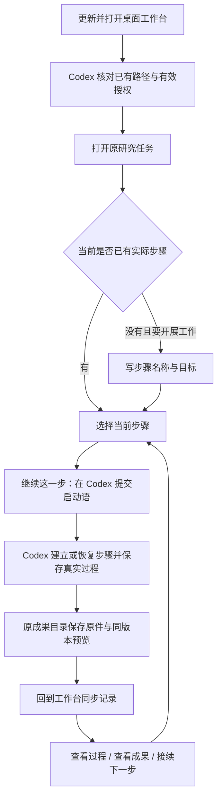

# 研究步骤与前端接续更新

版本：桌面 0.3.5；科研内容 1.23.0。

## 龚博士怎样使用

1. 顶部“检查更新”下载安装包；可复制更新与路径核对指令给本机 Codex。安装保留原数据，不重新配置有效的 GY 授权。
2. Codex 核对安装位置、默认工作区、知识库、活动课题、成果目录；科研技能按受管理更新器另行更新，桌面升级不自动覆盖私有技能。
3. 打开原研究任务，在“研究任务卡 → 当前研究步骤”点“添加本次步骤”，写名称与目标。普通问答可跳过。
4. 点“继续这一步”，检查启动语，进入原 Codex 对话或该工作区新对话并提交。Codex 在确认过的课题中创建记录，按真实动作写进度和下一步。
5. 回到工作台，已授权研究记录范围内自动同步，也可点“同步记录”。点“查看过程”展开只读记录；“查看本任务成果”回到同一任务的成果栏，再点文件卡预览。
6. 关闭后再次打开，保留原任务、当前步骤、草稿和预览状态；下一实际步骤开始时再添加新步骤。

## 边界与改造取舍

复用任务卡、本机状态保存、既有知识库授权、Codex 交接和成果预览。只增加步骤适配，不引入新的调度系统或科研文件副本。步骤草稿不代表落盘，磁盘进度不代表科学结论验证。

前端按任务编号及步骤键匹配。旧无键记录不会猜测绑定；跨课题同键重复直接报冲突。范围外记录或删除的文件保留本机索引并显示“待核对”，不当作现存记录。首次扩大范围仍要本人确认，已有范围不用重授。

路径检查只读取工作台/Obsidian 配置元数据及确认库的 Path-Map；私有路径仅在使用者本机保存，发行包没有代填的 GY 地址。自动化、笔记迁移、数据分析执行仍遵循原边界。

## 发布检查记录

维护者仅做前端/桌面构建、语法与文件完整性检查；未连接龚博士真实 Windows 电脑，未扫描私人 GY。Windows 安装与实际任务端到端体验需在她更新后按以上流程核对，不能以构建成功替代真实使用结果。
