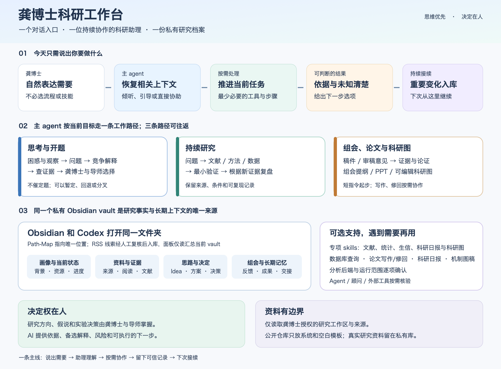
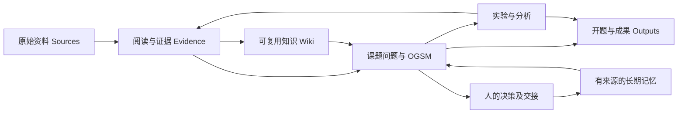

# 科研知识库 / Research Knowledge Vault

**思维优先，决策在人。** 这是空白科研知识库模板，尚无真实研究资料。日常只需先打开当前状态与Idea画布，其他内容按任务取用。

## 完整体系架构 / Architecture

从 Codex 对话提出任何研究任务，主引导会恢复上下文并选择需要的工作路径；Obsidian 负责浏览和整理同一个私有库。新手无需先安装可选技能。知识库不自动注入模型记忆；新会话时主引导按入口恢复必要内容。

## 从这里继续 / Start here

- [第一次使用与 Obsidian 接入](00_系统_System/01_使用指南_User-Guide.md)
- [当前状态 / Current state](05_课题项目_Projects/00_主课题_Main-Project/00_当前状态_Current-State.md)
- [想法画布 / Idea canvas](05_课题项目_Projects/00_主课题_Main-Project/01_思考过程_Thinking/01_想法画布_Idea-Canvas.md)
- [科研 OGSM / Research plan](05_课题项目_Projects/00_主课题_Main-Project/03_研究方案_Design/02_科研OGSM_Research-OGSM.md)
- [会话交接 / Handoff](11_长期记忆_Memory/03_会话交接_Session-Handoff.md)
- [未闭环事项 / Open loops](11_长期记忆_Memory/02_开放问题_Open-Loops.md)

- [准备组会 / Lab Meeting](10_日志复盘_Journal/03_组会_Lab-Meetings/00_index.md)
- [科研图索引 / Research Figures](08_成果输出_Outputs/03_图表_Figures/00_index.md)
- [做科研图 / Research Figure template](12_笔记模板_Templates/14_科研图_Figure.md)

## 全库导航 / Library map

| 目录 | 用途 |
|---|---|
| [00_系统_System](00_系统_System/00_index.md) | 规则、安装、路径映射与维护；先看总入口，按需读规则。 |
| [01_收件箱_Inbox](01_收件箱_Inbox/00_index.md) | 低门槛接收剪藏和困惑；待处理不等于证据。 |
| [02_原始资料_Sources](02_原始资料_Sources/00_index.md) | 保留来源原件；说明、读书笔记和提炼结果另存。 |
| [03_文献证据_Literature-Evidence](03_文献证据_Literature-Evidence/00_index.md) | 文献笔记与检索、逐项证据记录；同一论文按 DOI/PMID 去重。 |
| [04_知识百科_Wiki](04_知识百科_Wiki/00_index.md) | 可复用的概念、实体、主题与方法理解；每条保留来源和适用边界。 |
| [05_课题项目_Projects](05_课题项目_Projects/00_index.md) | 课题专属问题、计划、证据索引及人的决定。默认只有一个主课题。 |
| [06_方法流程_Methods](06_方法流程_Methods/00_index.md) | 有版本的 SOP、分析计划与方法复用；执行记录另记。 |
| [07_数据分析_Data-Analysis](07_数据分析_Data-Analysis/00_index.md) | 数据字典、数据集登记、实验记录、分析运行与质量检查。大数据留机构受控存储，库中只记去标识化索引。 |
| [08_成果输出_Outputs](08_成果输出_Outputs/00_index.md) | 可交付的开题、论文、报告和图表；发布版另存，不覆盖历史。 |
| [09_专家顾问_Advisors](09_专家顾问_Advisors/00_index.md) | 女娲顾问目录与使用记录。模拟观点不能作为真实导师意见。 |
| [10_日志复盘_Journal](10_日志复盘_Journal/00_index.md) | 阶段状态、会议与复盘；只在发生实质进展时记录。 |
| [11_长期记忆_Memory](11_长期记忆_Memory/00_index.md) | 长期有效的约束、可复用工作流和未闭环事项；必须有来源、范围、日期。 |
| [12_笔记模板_Templates](12_笔记模板_Templates/00_index.md) | Obsidian 核心 Templates 可直接插入；用源代码模式编辑模板变量。 |
| [13_附件资源_Attachments](13_附件资源_Attachments/00_index.md) | 有权保存的 PDF、图片及补充材料；避免同一附件多处复制。 |
| [14_历史归档_Archive](14_历史归档_Archive/00_index.md) | 失效计划、被替代条目及版本快照；归档不等于删除。 |

## 知识与研究的关系

文件存在不表示已经阅读，记忆存在不表示研究结论成立。公开发行包只含模板；把真实资料写入自己的私有 vault。
